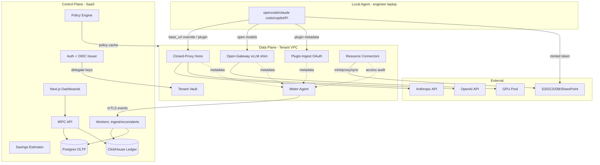
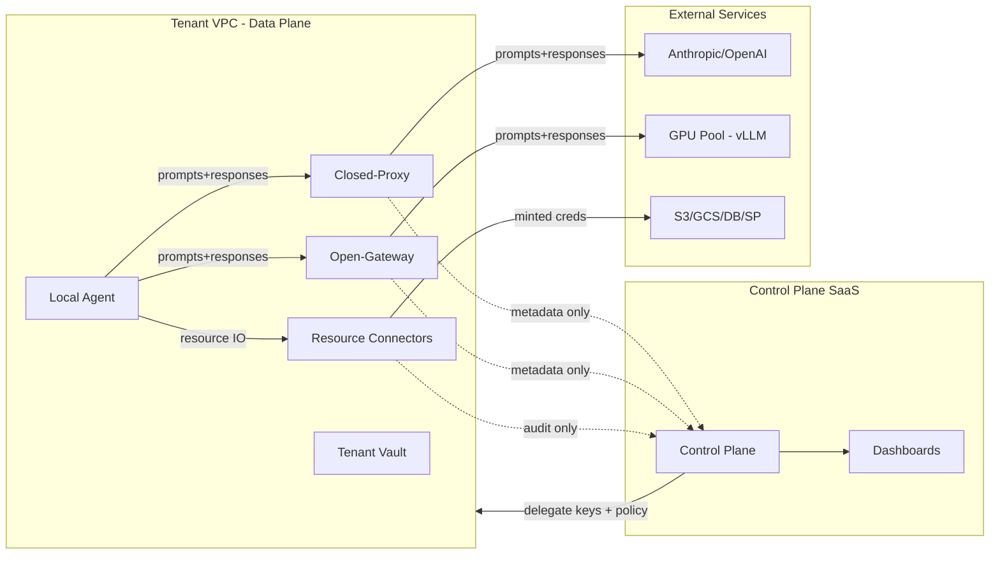
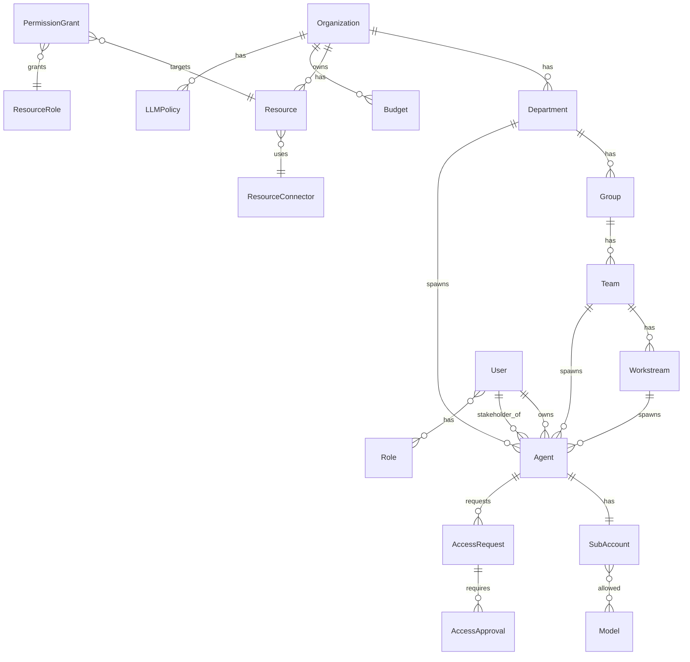
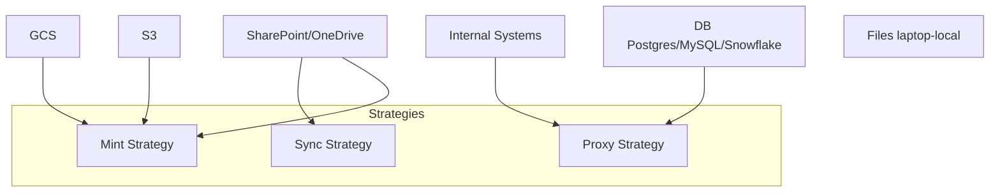
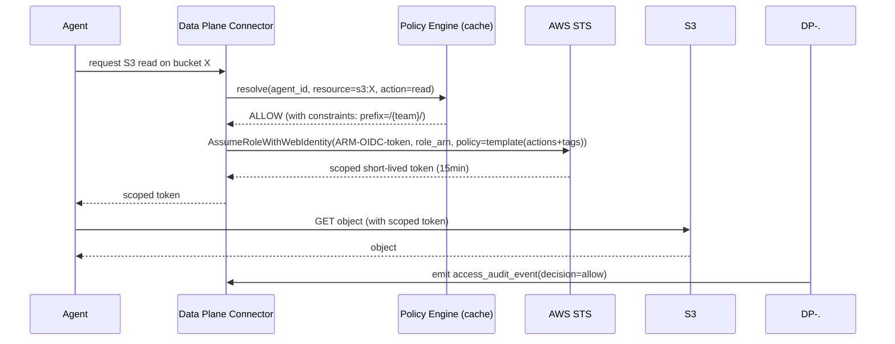
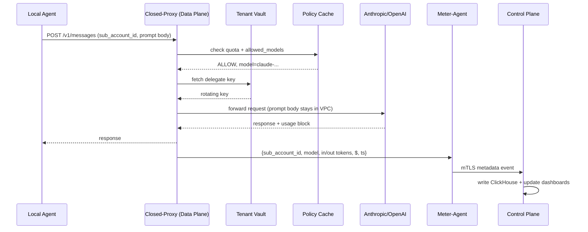
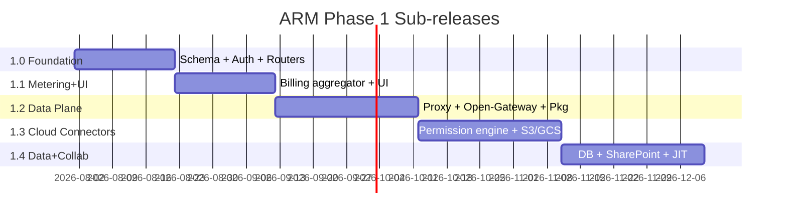

# ARM — Agent Resource Management Platform
## Specification v0.1

### Document Status
- **Drafted**: 2026-07-26
- **Scope**: Full Phase 1 (1.0–1.4) including LLM metering, dashboards, agent-IdP, and resource access connectors (S3, GCS, DB, SharePoint/OneDrive).
- **Decisions locked**:
  - Deployment: hybrid (SaaS control plane, on-prem data plane per tenant VPC).
  - Metering: self-hosted open gateway + closed-proxy as backbone; billing-API aggregator + agent plugins as fallback.
  - Billing: ARM brokers centrally with master provider keys + per-tenant delegate keys.
  - Stack: TypeScript monorepo (Next.js + tRPC + Postgres + ClickHouse + Drizzle).
  - Permissions: all three enforcement strategies (mint / proxy / sync), type-driven default; tiered delegation with deny-overrides; ARM as hybrid OIDC issuer (federated where supported, secrets vault where not).
  - Scope: everything — including DB + SharePoint/OneDrive — in Phase 1.

---

## 1. Overview

ARM is an HR-style platform for AI agents — a centralized plane for **identity, metering, routing, budgeting, policy enforcement, and resource-access control** of every LLM agent an organization spawns. An agent is treated as a "digital employee": it has an identity, a manager (a human **stakeholder** plus its team/workstream), a salary (token cost), a budget, an assigned tool (LLM model), a priority tier, and scoped permissions to organizational resources.

### 1.1 Problem statements addressed
1. Management cannot see how many agents are spawned per department/group/team/workstream, what LLMs they use, or what they cost.
2. Management cannot steer spend from expensive closed models (Claude, GPT) to cheaper self-hosted open models (GLM-5.2, DeepSeek, Kimi K3).
3. Engineers/marketers/sales/CS have no clean way to authenticate local coding agents (opencode, claude code, copilot, Pi) against org policy and quota.
4. Agents have no scoped access to organizational data sources (DBs, SharePoint, GCS, S3, OneDrive, internal systems) — either no access (useless) or over-broad standing access (security incident).
5. Agents are not all equal: business-critical agents (hot-issue resolvers, incident response) must take precedence over background agents (UX optimization, upgrades) when budget/quota is constrained — and automatically-spawned agents (running on behalf of a dept/team/workstream) need an accountable human, not anonymous automation.

### 1.2 Goals
- Single source of truth for **agent identity**, **LLM spend**, and **resource access** across the org tree.
- Live, exact metering with real-time enforcement, not lagging monthly bills.
- Privacy-by-design: prompt bodies and resource content never leave the tenant VPC.
- Cost-transparency tooling that drives migration to self-hosted open models where economics warrant.
- Priority-aware enforcement with accountability: scope-owned agents (auto-spawned at dept/team/workstream level) and user-owned agents share one identity/quota model; every agent has exactly one human stakeholder; critical agents preempt background agents under budget pressure.

### 1.3 Non-goals (Phase 1)
- ML-driven anomaly detection and forecasting (Phase 5).
- Multi-region active-active HA for the proxy (Phase 5).
- Custom model fine-tuning / hosting beyond inference (out of scope).
- SCIM user provisioning (Phase 2).
- DLP content scanning (Phase 2 hook points reserved).

---

## 2. Stakeholders & Personas

| Persona | Surface | Key workflows |
|---|---|---|
| **Org admin** | Control plane web | Configure org tree, IdP federation, master provider keys, global policy defaults. |
| **Department manager** | Control plane web | View dept spend, set dept budgets/model allowlists, approve critical-tier designation, act as stakeholder for dept-owned agents, receive switch recommendations, approve elevated access. |
| **Team lead** | Control plane web | Allocate per-agent quotas, spawn/manage team-owned agents (as stakeholder), set agent priorities, request/grant resource access within team subtree. |
| **Engineer / Marketer / Sales / CS** | Control plane web + local agent | SSO login, register agent, copy config snippet, view personal spend/quota, request JIT data access. |
| **InfoSec / Compliance** | Control plane web (read + audit) | Inspect access audit, deny-overrides, classification gates, prompt-content retention posture. |

---

## 3. System Architecture

### 3.1 High-level topology

```
┌──────────────────────────────────────────────────────────────────────────┐
│                         ARM CONTROL PLANE (SaaS)                         │
│  ┌──────────────┐  ┌──────────────┐  ┌──────────────┐  ┌──────────────┐  │
│  │  Next.js Web │  │  tRPC API    │  │  Workers     │  │  Auth/OIDC   │  │
│  │  Dashboards  │──│  Routers     │──│  Billing/Audit│  │  Issuer +SSO │  │
│  └──────────────┘  └──────┬───────┘  └──────┬───────┘  └──────┬───────┘  │
│                          │                 │                 │           │
│  ┌───────────────────────────────────────────────────────────────────┐   │
│  │  Policy Engine (LLM routing + Access grants + Budget + Deny-OVR) │   │
│  └───────────────────────────────────────────────────────────────────┘   │
│  ┌─────────────────┐   ┌─────────────────┐   ┌────────────────────┐     │
│  │ Postgres (OLTP) │   │ ClickHouse      │   │ Savings Estimator  │     │
│  │ Org/Id/Grants   │   │ Usage+Audit     │   │ GPU $/Mtok model   │     │
│  └─────────────────┘   └─────────────────┘   └────────────────────┘     │
└──────────────────────────────────────┬───────────────────────────────────┘
                                       │ metadata-only events (mTLS)
                                       │ {sub_account_id, agent_id, model,
                                       │  in/out tokens, $, ts}
                       ┌───────────────┴────────────────┐
                       │  Per-tenant delegate key sync  │
                       │  + policy cache refresh        │
                       ▼                                ▼
┌──────────────────────────────────────────────────────────────────────────┐
│                  ARM DATA PLANE (per-tenant, in customer VPC)            │
│  ┌─────────────┐  ┌─────────────┐  ┌─────────────┐  ┌─────────────────┐  │
│  │ Closed-Proxy│  │ Open-Gateway│  │ Plugin-Ingest│ │ Resource        │  │
│  │ (Hono)      │  │ (vLLM shim) │  │ (OAuth+Webhk) │ │ Connectors      │  │
│  │ OpenAI/Anth.│  │ GLM/DS/Kimi │  │              │ │ S3/GCS/DB/SP    │  │
│  └──────┬──────┘  └──────┬──────┘  └──────┬───────┘ └────────┬────────┘  │
│         │                │                │                  │            │
│         └────────────────┴────────────────┴──────────────────┘            │
│                                │                                          │
│                         ┌──────▼──────┐                                   │
│                         │ Meter-Agent │ → events up to control plane       │
│                         └─────────────┘                                   │
│  ┌──────────────────────────────────────────────────────────────────┐   │
│  │ Tenant Vault (sealed secrets, short-lived delegate keys)         │   │
│  └──────────────────────────────────────────────────────────────────┘   │
└──────────────────────────────────┬───────────────────────────────────────┘
                                   │
              ┌────────────────────┼───────────────────────┐
              ▼                    ▼                       ▼
   ┌──────────────────┐  ┌──────────────────┐   ┌────────────────────┐
   │ Anthropic/OpenAI │  │  vLLM GPU pool   │   │ Organizational     │
   │ (closed models)  │  │  (open models)   │   │ Data Sources        │
   │                  │  │                  │   │ (S3/GCS/DB/SP/etc) │
   └──────────────────┘  └──────────────────┘   └────────────────────┘
```

### 3.2 Component responsibilities



### 3.3 Hybrid trust & data-flow boundaries



| Boundary | What crosses | What never crosses |
|---|---|---|
| Agent → Data plane | Wire-protocol LLM calls; resource access calls with scoped tokens | — |
| Data plane → External providers | LLM requests (closed) or GPU inference (open); resource IO with minted creds | — |
| Data plane → Control plane | Metadata-only events: tokens, $, audit decisions, agent id, ts | **Prompt bodies, resource content, raw credentials** |
| Control plane → Data plane | Delegate keys (rotating, short-lived), policy cache | Resource content, prompts |
| Control plane → Dashboard viewer | Aggregates, per-agent/per-team rollups | Prompts, content, secrets |

---

## 4. Data Model

### 4.1 Postgres (OLTP)

```
Organization(id, name, idp_config)
  └── Department(id, org_id, name)
        └── Group(id, dept_id, name)
              └── Team(id, group_id, name)
                    └── Workstream(id, team_id, name)

User(id, org_id, email)
Role(id, scope_type, scope_id, name, permissions[])
UserRole(user_id, role_id)   # many-to-many junction; preserves referential integrity
# owner_user_id NULL for scope-owned (auto-spawned) agents; stakeholder_user_id is ALWAYS set —
# every agent has exactly one accountable human (receives alerts, first-line JIT contact,
# accountable for spend + access). scope_type/scope_id points at any org-tree node;
# project_tag is a cross-cutting reporting dimension, NOT a tree level.
Agent(id, owner_user_id NULL, stakeholder_user_id NOT NULL,
      scope_type ENUM('org','department','group','team','workstream'), scope_id,
      project_tag NULL, type, status,
      priority_tier ENUM('critical','standard','background') DEFAULT 'standard',
      spawned_by ENUM('user','automation','template'),
      sub_account_id, created_at)
SubAccount(id, user_id NULL, agent_id, api_key_hash, allowed_models[], quotas_json)
DelegateKey(id, tenant_id, provider, key_ref, rotated_at, expires_at)

Model(id, provider, name, kind ENUM('closed','self_hosted'),
      list_price_in, list_price_out, internal_price_in, internal_price_out,
      context_window, hosted_endpoint?)

# LLM policy
Budget(scope_type, scope_id, period, usd_cap, model_allocations_json,
       priority_reservations_json)   # e.g. {"critical_reserve_pct": 20, "background_floor_pct": 5}
LLMPolicy(scope_type, scope_id, allowed_models[], auto_downgrade_to,
          per_agent_day_cap, approval_required_for[],
          per_priority_caps_json)     # e.g. {"background": {"day_cap_usd": 50, "models": ["self_hosted/*"]}}

# Resource access
Resource(id, type ENUM('db','sharepoint','gcs','s3','onedrive','files','internal'),
         connector_id, external_ref, classification, tags_json, tenant_id)
ResourceConnector(id, type, auth_mechanism,
                  vending_strategy ENUM('proxy','mint','sync'))
ResourceRole(id, name, actions[])
PermissionGrant(principal_type ENUM('role','agent','team','workstream','dept'),
                principal_id, resource_id, actions[], constraints_json,
                granted_by, granted_at, expires_at)
ClassificationLevel(id, rank, name)   # public, internal, confidential, restricted
AccessRequest(id, requester_agent_id, resource_id, actions[], reason, status,
              approver_id, created_at, decided_at)
AccessApproval(id, request_id, approver_id, decision, conditions_json, decided_at)
```

### 4.2 ClickHouse (events ledger)

```sql
CREATE TABLE token_usage_event (
  ts              DateTime64(3),
  tenant_id       String,
  sub_account_id  String,
  agent_id        String,
  priority_tier   LowCardinality(String),
  model_id        String,
  input_tokens    UInt64,
  output_tokens   UInt64,
  cost_usd        Decimal(12,6),
  source          Enum('proxy','gateway','plugin','billing_api')
) PARTITION BY (tenant_id, toYYYYMM(ts))
  ORDER BY (tenant_id, ts);

CREATE TABLE access_audit_event (
  ts            DateTime64(3),
  tenant_id     String,
  agent_id      String,
  resource_id   String,
  action        String,
  decision      Enum('allow','deny','jit_grant'),
  reason        String,
  connector     String
) PARTITION BY (tenant_id, toYYYYMM(ts))
  ORDER BY (tenant_id, ts);
```

### 4.3 Entity relationships



**Agent ownership & accountability**: user-owned agents have `owner_user_id` set; scope-owned agents (auto-spawned by automation/templates at any tree level) have `owner_user_id NULL` and `scope_type/scope_id` pointing at their node. **Every agent — user-owned or scope-owned — has a non-null `stakeholder_user_id`**: one accountable human. `project_tag` models cross-team initiatives as a reporting dimension and optional ABAC attribute — it is **not** an inheritance level.

---

## 5. Core Components

### 5.1 Control Plane

**Auth & OIDC Issuer** (`packages/auth` extended)
- Consumes SSO (Google/Okta via OIDC; SAML deferred to Phase 2).
- **Issues** OIDC tokens for agents — federated into corporate IdP (Entra/Okta) so resources see "ARM on behalf of agent X in team Y", not "eric's laptop".
- Mints per-tenant **delegate keys** for providers (Anthropic/OpenAI) and rotates them on short TTL.

**Policy Engine**
- Two policy domains, one resolver:
  - *LLM routing*: allowed models per scope, auto-downgrade rules, spend caps.
    - **Auto-downgrade contract**: whenever `auto_downgrade_to` fires, the response surfaces the actually-served model in the `model` field (per OpenAI/Anthropic convention); silent semantic drift is forbidden.
  - *Access grants*: tiered inheritance, deny-overrides, classification gates.
- **Priority-aware budget enforcement** (tiers `critical` > `standard` > `background`): on budget pressure the resolver degrades lower tiers first — `background` agents are (1) auto-downgraded to open models, (2) throttled, (3) queued/blocked; `standard` throttles only after `critical_reserve` is exhausted; `critical` draws on the reserve until hard cap. Tier assignment and stakeholder governance in §6.6.
- **Cross-link**: classification tag on a resource restricts which LLM may receive that resource's content (e.g. `confidential` content cannot be sent to closed external models).

**Savings Estimator**
- Per-workstream comparison: current closed-model spend vs projected self-host cost for GLM-5.2 / DeepSeek / Kimi K3.
- Internal price model: `GPU_class $/hr × hours × concurrency → $/M-tokens`.
- Drafts "switch" reminders to dept managers with $ delta + migration effort estimate + one-click policy change.

**Dashboards** (Next.js)
- Org-tree explorer with agent counts (user-owned vs scope-owned), active vs idle, model mix, priority-tier mix.
- Cost rollups (per node, model, user, priority tier), trend, 30-day forecast, budget burndown.
- Resource-access audit views rolled into the same surface.

### 5.2 Data Plane

**Closed-Proxy** (Hono, OpenAI + Anthropic wire-compatible)
- Validates sub-account credential → fetches rotating delegate key from tenant vault → routes to provider.
- Reads response `usage` block for exact metering; **prompt bodies never persisted**.
- Enforces quota locally. Quota/routing decisions **fail-closed** if the control plane is unreachable (agent blocked); metering **event emission** fails-open (best-effort buffer + retry, never blocks the call). See §13 Open Item 3.
- Enforces quota **priority-aware**: applies the tier ladder from §5.1 — `background` → downgrade → throttle → queue (`429 + Retry-After`); `standard` → throttle; `critical` → reserve draw. Hard cap still fails closed for all tiers; every tier action alerts the agent's stakeholder.

**Open-Gateway** (vLLM + TS shim, OpenAI-compat)
- Hosts GLM-5.2, DeepSeek, Kimi K3.
- Native metering at serving layer → emits events to meter-agent.
- Computes live internal $/M-token from GPU amortization → feeds savings estimator.

**Plugin-Ingest** (fallback path)
- OAuth issuer + webhook for agent-native plugins (opencode hooks, claude code MCP, copilot extensions).
- Receives metadata events from plugins that report directly rather than going through the proxy.

**Resource Connectors** (per-type strategy)
- **S3 connector** — *mint strategy*: STS AssumeRoleWithWebIdentity (federated OIDC), IAM policy templated from grant actions + tags.
- **GCS connector** — *mint strategy*: Workload Identity + scoped OAuth / signed URLs.
- **DB connector** — *proxy strategy*: holds master conn string in tenant vault, per-call policy + query audit. Postgres, MySQL, Snowflake.
- **SharePoint/OneDrive connector** — *mint+sync hybrid*: Graph API scoped tokens via ARM-OIDC-issuer; reconcile site/doc permissions as sync grants.

**Meter-Agent**
- Consolidates events from proxy / gateway / plugins / connectors.
- Dedupes concurrent agents.
- Pushes metadata-only events to control plane over mTLS.

**Tenant Vault**
- Sealed storage for secrets (legacy DB creds where OIDC not supported).
- Short-lived delegate key cache.

---

## 6. Permission & Access Control

### 6.1 Resolution model

**RBAC + ABAC hybrid.**
- RBAC: agent has resource roles ("db-reader", "sharepoint-contributor", "s3-readonly-with-prefix").
- ABAC: agent's `workstream` ∈ resource's `allowed_workstreams` AND agent's `classification_clearance` ≥ resource's `classification.rank`.

**Inheritance chain**: Org default → Dept → Group → Team → Workstream → Agent.
- Each level can **narrow** (deny) within its authority.
- Per-resource explicit grants refine defaults.
- **Higher-level deny always wins**, even against a lower-level explicit allow. "Higher" = closer to the Org root (most authoritative); Workstream/Agent are the lowest authority.

### 6.2 Enforcement strategies (type-driven)



| Resource type | Strategy | Mechanism |
|---|---|---|
| S3 | mint | STS AssumeRoleWithWebIdentity (OIDC federation) + templated inline IAM policy |
| GCS | mint | Workload Identity + scoped OAuth |
| DB (Postgres/MySQL/Snowflake) | proxy | ARM data-plane brokers every query |
| SharePoint / OneDrive | mint + sync | Graph API scoped tokens + permission sync |
| Internal systems | proxy | ARM data-plane brokers |
| Files (laptop-local) | n/a (agent-side) | Out of ARM scope; classification tag still gates LLM routing |

### 6.3 Identity model (hybrid issuer)

- **Federated where supported**: S3 IAM, GCS Workload Identity, Graph API trust ARM-issued OIDC tokens as service principals.
- **Secrets vault where not**: legacy DBs, internal systems — ARM stores sealed creds in tenant vault; access-logged per call.

### 6.4 Approval workflow (JIT)
- Agent owner requests elevated access; request routed to scope-appropriate approver (team lead / dept manager). For scope-owned agents the **stakeholder** is the requester-of-record and first-line contact.
- Approver grants short-TTL permission (15–60 min) via minted credential or proxy session.
- All decisions logged to `access_audit_event`.

### 6.5 DLP & cross-domain gates
- Classification tag on a resource **gates LLM model routing** — confidential+ content cannot be sent to closed external models. This is the single bidirectional link between the LLM-policy and access-policy domains.
- Phase 2 reserves hook points for content-pattern DLP at the proxy; Phase 1 ships metadata-only audit by default.

### 6.6 Agent priority, tier & stakeholder governance

- **Stakeholder (accountability)**: every agent — user-owned or scope-owned — has exactly one human `stakeholder_user_id`. The stakeholder is accountable for the agent's spend, access, and behavior; receives budget/security alerts; and is the first-line contact for JIT approvals (§6.4). For user-owned agents the stakeholder defaults to the owner. For scope-owned agents the stakeholder is assigned at spawn time (default: the scope admin or the automation-template author). Stakeholder departure triggers re-attestation — transfer to another human or retire the agent (§12).
- **Tiers**: `critical` (incident/hot-issue resolvers, revenue-path), `standard` (default), `background` (UX optimization, upgrades, experiments).
- **Assignment is policy, not self-declared**: user-owned agents default to `standard`. `critical` designation requires approval by the scope admin (team lead for team scope, dept manager for dept+ scope) and is logged to `access_audit_event`. `background` may be self-assigned or set by automation.
- **Scope-owned agents** (auto-spawned by automation/templates) get their tier from the spawning template; template authoring is restricted to scope admins.
- **Clearance inheritance**: scope-owned agents inherit `classification_clearance` from their scope node, capped at the scope's clearance — a background agent spawned by a team cannot exceed the team's clearance.
- **Starvation guard**: each scope may reserve a minimum floor for `background` (e.g. nightly windows) so permanent budget pressure doesn't starve optimization work entirely; monitored via a starvation metric in dashboards.

---

## 7. LLM Metering & Billing

### 7.1 Collection strategies (in priority order)

1. **Closed-proxy** (live, exact) — reads provider `usage` block; authoritative.
2. **Open-gateway native metering** (live, exact) — emits at serving layer.
3. **Plugin ingest** (live, metadata) — for agents that bypass the proxy.
4. **Provider billing-API aggregator** (lagging, coarse) — backstop for agents you genuinely cannot intercept; attributes cost by delegate-key tag.

### 7.2 Brokerage model
- ARM holds master Anthropic/OpenAI keys, negotiates volume discounts centrally.
- Issues per-tenant **delegate keys**; tags traffic by key → attribute monthly bill back to tenant.
- Resells at negotiated rate; per-tenant delegate keys enable enforcement without exposing prompts to ARM.

### 7.3 Reconciliation
- Daily job: provider master bill → delegate key → tenant. Surfaces drift >5% between billing-API $$ and proxy $$ as alerts.

---

## 8. Key User Flows

### 8.1 Engineer spawns an agent

```
1. Engineer ──SSO──▶ ARM Control Plane
2. Engineer creates Agent; ARM issues {sub_account_id, scoped delegate key}
3. ARM returns copy-paste config snippet (env vars / plugin config)
4. Engineer configures opencode/claude code/copilot/Pi with:
     base_url = tenant data-plane proxy URL
     api_key  = sub-account credential
5. Agent runs. Outbound LLM call ──▶ Data-Plane Proxy/Gateway
6. Data plane authenticates, applies quota, routes, emits metadata event
7. Meter-Agent ──mTLS──▶ Control Plane ──▶ ClickHouse ledger
8. Dashboards, budgets, alerts, savings recs update near-real-time
```

### 8.2 Agent accesses an S3 bucket



### 8.3 Management switches workstream to open model

```
1. Dept manager opens Savings view for Workstream W
2. Engine shows: current Claude $X/mo vs projected GLM-5.2 $Y/mo (Δ $Z, effort: low)
3. Manager clicks "Apply switch policy"
4. Policy Engine updates LLMPolicy for W:
     allowed_models=[glm-5.2], auto_downgrade_to=glm-5.2
5. Policy cache pushed to data plane
6. Next agent call for W routes to Open-Gateway instead of closed-proxy
7. Savings tracked in dashboards vs prior 30-day baseline
```

### 8.4 LLM call lifecycle (proxy path)



### 8.5 Scope-owned agent lifecycle & priority preemption

```
1. Automation (or team lead) registers an Agent at a scope node — e.g. hot-issue resolver at
   Team T (critical), UX optimizer at Dept D (background) — and assigns a stakeholder
   (default: scope admin / template author)
2. ARM issues {sub_account_id, delegate key}; owner_user_id NULL, stakeholder_user_id set
3. Agent runs on schedule/triggers via the same data-plane paths as user agents (§8.1 steps 5–8)
4. Dept budget hits 80%: Policy Engine orders background tier to auto-downgrade to open models
5. Budget hits 95%: background throttled/queued (429 + Retry-After); standard throttled
   after critical_reserve exhausted
6. Critical agents (hot-issue resolvers) continue on reserve until hard cap; stakeholder
   alerted at each tier action; every tier change emits audit + dashboard events
```

---

## 9. Phase Plan

### 1.0 — Foundation
- Monorepo (pnpm + Turborepo); strict TS, ESLint, Prettier.
- Postgres schema: org tree, users/roles, agents (user-owned **and scope-owned**, with priority tiers + stakeholders), sub-accounts, models, budgets (with priority reservations), LLM policy, **resources, grants, classifications, connectors, access audit**.
- ClickHouse schemas: `token_usage_event`, `access_audit_event`.
- Auth: OIDC SSO + RBAC + **ARM-as-OIDC-issuer**.
- tRPC routers for all CRUD/query surfaces.

### 1.1 — LLM Metering & Dashboards
- Anthropic + OpenAI admin-API connectors (Resolution D backstop).
- Delegate-key minting + per-tenant attribution.
- Workers: daily usage pull, reconciliation, drift alerts.
- Dashboards: org-tree explorer, cost rollups (incl. per-priority-tier + per-stakeholder), savings estimator, hosting-cost model, alerts, model-mix.

### 1.2 — Closed-Proxy + Open-Gateway Data Plane
- Hono closed-proxy (OpenAI/Anthropic wire), delegate-key rotation, local quota, **priority-aware budget enforcement (tier ladder)**, metadata-only metering.
- vLLM open-gateway (GLM-5.2 / DeepSeek / Kimi K3) + OpenAI-compat shim + native metering.
- meter-agent consolidation → control plane over mTLS.
- **Packaging**: Dockerfiles + `docker-compose.yml` + **Helm chart** (`arm-data-plane` with subcharts) + **Terraform module** (customer VPC: IAM role + Secret Manager + EKS/ECS targeting Helm).
- `arm data-plane install` CLI: register tenant → pull delegate key → render chart → apply.

### 1.3 — Resource Access: Cloud-Native Connectors
- Permission engine: RBAC + ABAC, inheritance, deny-overrides, JIT approval skeleton, audit emit.
- **S3 connector** (mint strategy): STS AssumeRoleWithWebIdentity (OIDC federation) with IAM policy templated from grants + tags.
- **GCS connector** (mint strategy): Workload Identity + scoped OAuth / signed URLs.
- Resource catalog UI; grant authoring with tiered delegation; deny-overrides preview.
- Real Okta/Entra federation integration test (live IdP verification).

### 1.4 — Resource Access: Data + Collaboration Connectors
- **DB connector** (proxy strategy): master conn string in tenant vault, per-call policy + query audit. Postgres, MySQL, Snowflake.
- **SharePoint/OneDrive connector** (mint+sync hybrid): Graph API via ARM-OIDC-issuer for scoped tokens; site/doc permission **sync grants** + **drift detection job from day one**.
- Approval workflow for JIT requests; classification tag enforcement on LLM routing.
- Access audit dashboards rolled into management surface.

### 1.x Phase sequencing



### Phases 2–5 (deferred)
- **Phase 2**: SAML/SCIM, DLP content hooks, full approval workflow UX.
- **Phase 3**: GPU capacity brokering across tenants; complete open-model fleet.
- **Phase 4**: first-party agent plugins (opencode hooks, claude code MCP, copilot extensions) + OAuth flow.
- **Phase 5**: forecasting ML, anomaly detection, managed key rotation, active-active HA proxy.

---

## 10. Tech Stack

| Layer | Choice | Rationale |
|---|---|---|
| Monorepo | pnpm + Turborepo | Fast TS workspace, incremental builds |
| Control-plane web | Next.js 15 (App Router) | Modern admin UI, SSR dashboards |
| API | tRPC v11 | End-to-end TS types, no codegen |
| OLTP | Postgres + Drizzle | Migration story, strong types |
| Event store | ClickHouse | High-volume ledger + analytics |
| Data-plane proxy | Hono | Edge-friendly, fast, wire-protocol simple |
| Open-gateway | vLLM + TS shim | Best-in-class open inference + OpenAI-compat |
| Auth | Auth.js / Ory + custom OIDC issuer | SSO consumer + issuer in one package |
| Validation | zod | Shared contracts across services |
| Infra | Terraform + Helm + Docker Compose | Multi-target packaging |

---

## 11. Cross-cutting Invariants

1. **Prompt bodies + resource content never leave the tenant VPC.** Control plane is metadata + audit only.
2. **One agent identity, two stable IDs**: `sub_account_id` (LLM/metering side) and `agent_id` (access side) are linked 1:1 on the same agent. Analytics joins use `agent_id`, which is present in both event tables.
3. **Higher-level deny always wins** in grant resolution; rules table per principal×resource type documented in `docs/permission-rules.md`.
4. **Short-lived credentials everywhere** credentials are issued (mint strategy) — guaranteed fast revocation.
5. **Hybrid IdP story**: ARM-issued OIDC tokens for federated resources; sealed tenant vault for legacy secrets.
6. **ClickHouse partitioning by `(tenant_id, toYYYYMM(ts))` from day 1** — non-negotiable for multi-tenant scale.
7. **Every agent has exactly one accountable human stakeholder** (`stakeholder_user_id`, non-null) — no anonymous automation, including auto-spawned scope-owned agents.
8. **Priority is policy, not self-declared**: elevated tiers require scope-admin approval and are audited; the enforcement ladder (downgrade → throttle → queue) is uniform across proxy/gateway paths.

---

## 12. Risks & Mitigations

| Risk | Impact | Mitigation |
|---|---|---|
| Anthropic/OpenAI wire-protocol drift | Proxy breaks | Version-sniff in proxy, pin behavior, track provider changelogs |
| Delegate-key rotation vs proxy uptime | Brief auth gaps | Short TTL + warm refresh, overlap window |
| ClickHouse event volume at scale | Query slowdown | Partition by tenant+month from day 1; aggregates materialized |
| Hybrid reconciliation gap (billing $$ vs proxy $$) | Wrong cost attribution | Alert on >5% drift; investigate root cause before close |
| OIDC issuer misconfig with corporate IdP | Agents impersonate wrongly | Live Okta/Entra integration test in 1.3, not deferred |
| SharePoint/Graph perm sync drift | Stale grants left active | Drift detection job from day one in 1.4 |
| Cross-tenant resource leakage | Security incident | Partition aggregations by `tenant_id`; mandatory tenant filter on all queries |
| Phase 1 size has grown ~2× | Timeline pressure | Sub-release as 1.0–1.4; revisit splitting 1.4 to Phase 2 if needed |
| Prompt privacy backslide | InfoSec block | Default no-content retention; DLP hook points reserved in 1.4, shipped in Phase 2 |
| Master provider-key compromise | Unlimited cross-tenant spend, impersonation | HSM/KMS-wrapped master keys, tight rotation, per-tenant spend anomaly alerts, blast-radius containment |
| GCS signed-URL bearer-token leak | Unauthorized object access until TTL | Short TTL, scope-by-prefix, issuance logged to `access_audit_event` |
| Bypass-agent live enforcement gap | Quota caps applied only after the fact (billing reconciliation) | Phase 1: require bypass paths to opt into provider-side delegate-key spend caps; default-block bypass by policy where unsupported |
| Priority-tier abuse (self-marked critical) | Budget bypass, critical-tier crowding | Tier assignment is policy (§6.6); `critical` requires scope-admin approval; tier changes audited |
| Background-tier starvation under chronic budget pressure | Optimization/upgrade work never runs | Minimum floor / scheduled windows per scope; starvation metric in dashboards |
| Orphaned scope-owned agents (scope deleted/reorged, stakeholder departs) | Zombie spend, dangling access, no accountable human | Cascade-disable on scope delete; stakeholder re-attestation on departure (transfer or retire); TTL for automation-spawned agents |

---

## 13. Open Items

1. **1.4 placement**: keep DB + SharePoint in Phase 1, or defer to Phase 2 if execution pressure surfaces during 1.0–1.3. Decision deferred until 1.3 complete.
2. **Enterprise procurement model**: does ARM resell provider credits (regulated in some jx) or pass through customer's own master keys? Default: ARM brokers; revisit before 1.2 GA.
3. **Fail-open vs fail-closed policy** when control plane unreachable: default fail-closed for access (safer), fail-open for LLM metering (don't block work). Needs sign-off from InfoSec.
4. **Scope of "files" resource** — laptop-local files are out of ARM scope; only classification tag crossover applies. Confirm with InfoSec.
5. **Critical-tier budget-exhaustion behavior**: draw on `critical_reserve` + alert (default) vs hard cap even for critical agents. Needs InfoSec + finance sign-off.

---

## 14. Repository Layout (target)

```
arm/
  apps/
    control-plane/
      web/            # Next.js dashboards
      api/            # tRPC routers + Next server
      workers/        # billing ingest, reconciliation, alerts, forecasts
    data-plane/
      proxy/          # Hono OpenAI+Anthropic-compat router
      open-gateway/   # vLLM shim (OpenAI-compat)
      plugin-ingest/  # OAuth issuer + plugin webhook
      meter-agent/    # event consolidator → control plane
      connectors/     # s3, gcs, db, sharepoint packages
  packages/
    db/               # Drizzle schema + migrations (Postgres)
    clickhouse/       # ClickHouse schema + migrations
    trpc/             # shared routers/types
    auth/             # OIDC SSO + OIDC issuer + RBAC
    billing/          # provider billing-API connectors + reconciliation
    policy/           # LLM + access policy resolver
    proto/            # event schemas (zod) shared across services
    config/           # env, validation, secrets
  infra/
    terraform/        # control-plane cloud + tenant data-plane module
    helm/             # arm-data-plane chart + subcharts
    compose/          # docker-compose (local dev + single-node data plane)
    docker/           # per-service Dockerfiles
  docs/
    architecture.md
    data-model.md
    arm-spec.md           # ← this document
    permission-rules.md   # inheritance/deny-override rules table
    open-decisions.md     # review-derived decisions to lock (D1/D2/D5)
    figures/              # rendered architecture diagrams (mermaid + PNG)
```

---

*End of spec v0.1. Figures use Mermaid (renders natively on GitHub) and ASCII where Mermaid is unsuitable. A follow-up `docs/permission-rules.md` will document the tiered-delegation rules table once 1.3 schema is finalized.*