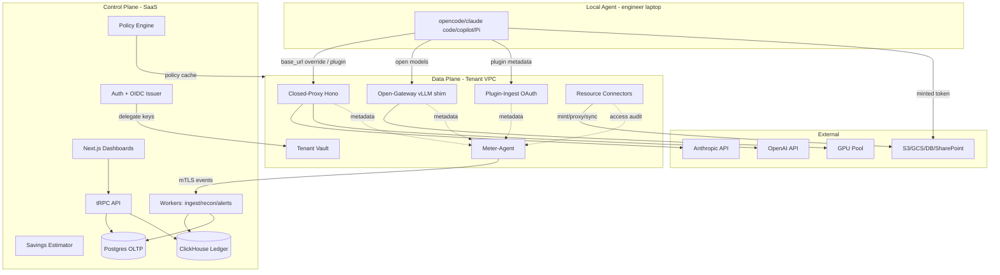
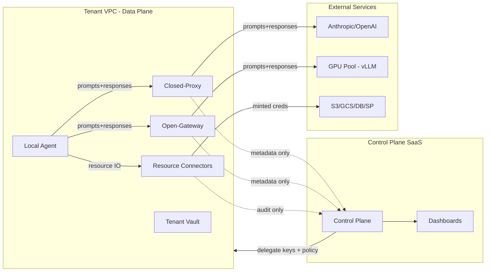
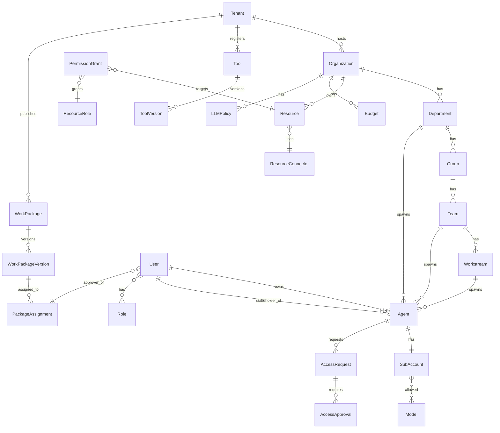
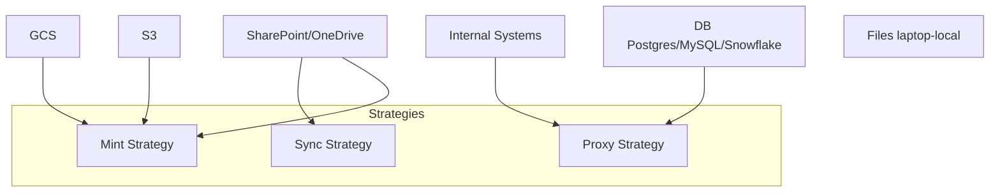
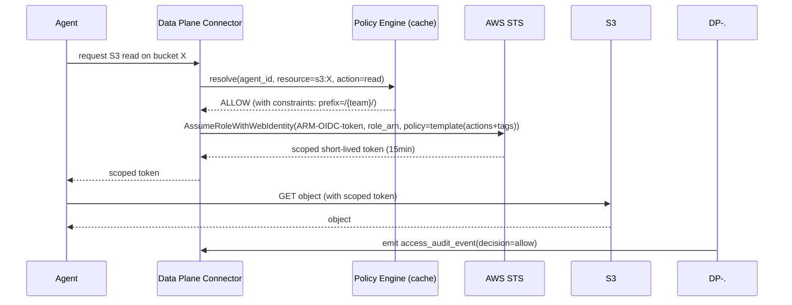
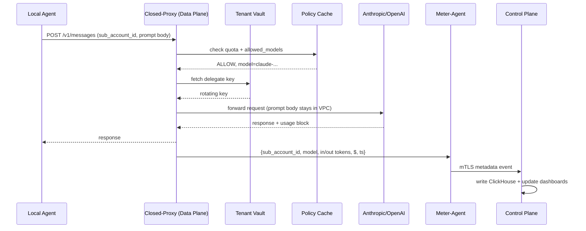
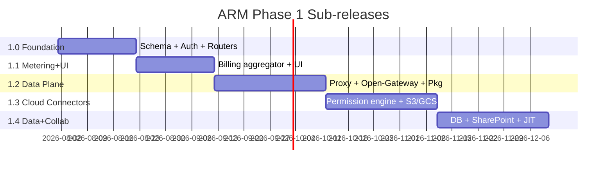

# ARM — Agent Resource Management Platform
## Specification v0.5

### Document Status
- **Drafted**: 2026-07-26 (v0.1)
- **v0.2** (2026-07-26): review patches applied (diagram fixes, UserRole junction, AssumeRoleWithWebIdentity, risk rows); scope-owned (auto-spawned) agents + priority tiers + stakeholder governance (§4, §6.6, §8.5); engineering guardrails as code (§14) adopted from worldmonitor review; agent-onboarding CLI + `/.well-known/arm-agent` discovery (§8.1, §5.2); repo layout expanded (§15)
- **v0.3** (2026-07-26): open decisions locked — D1-b (Tenant above Organization; dual delivery: SaaS + self-hosted enterprise, §3.4); D2-a (classification gate via context tagging at vend/return, §6.5); D5 (pull-based policy distribution with version watermark, push deferred to Phase 2+, §5.1)
- **v0.4** (2026-07-26): frontend/UI plan — §5.3 Web UI (information architecture, role-scoped views, high-stakes action pattern, policy simulator, realtime via tRPC/SSE, deferred-shell stability, design system, onboarding UX, notification surfaces, a11y/testing stances); 1.0 gains web shell + wireframes; 1.3 gains policy simulator
- **v0.5** (2026-07-26): gstack plan review applied — success criteria & exit gates (§9/1.y), agent-adoption risk row (§12), proxy performance budget + eventual-quota semantics (§5.2), 1.2 vertical-slice exit gate (§9), classification-context write-path hardening (§6.5), meter-agent disk-backed buffer (§5.2), scheduling assumptions + zero-slack note (§9), own-telemetry baseline (§9), differentiation statement (§1), notification preferences (§5.3)
- **v0.6** (2026-08-13): D9 Work Packages foundation landed — Tool Registry + WorkPackage/Version/Assignment tables (§4.1), `token_usage_event` package-attribution columns (§4.2), `tool:*` authorization verbs (§6.2), employee provisioning flow `arm setup` + connections wizard (§8.6), client packages (`client-core`, CLI `setup`, plugin-ingest manifest) (§15), 4 new guardrails (§14.1), phases 1.5–1.7 (§9). Decision: `docs/solutions/2026-08-13-d9-work-packages.md`; roadmap: `docs/solutions/2026-08-13-work-package-roadmap.md`; research: `docs/research/`.
- **Scope**: Full Phase 1 (1.0–1.4) including LLM metering, dashboards, agent-IdP, and resource access connectors (S3, GCS, DB, SharePoint/OneDrive).
- **Decisions locked**:
  - Deployment: hybrid (SaaS control plane, on-prem data plane per tenant VPC).
  - Metering: self-hosted open gateway + closed-proxy as backbone; billing-API aggregator + agent plugins as fallback.
  - Billing: ARM brokers centrally with master provider keys + per-tenant delegate keys.
  - Stack: TypeScript monorepo (Next.js + tRPC + Postgres + ClickHouse + Drizzle).
  - Permissions: all three enforcement strategies (mint / proxy / sync), type-driven default; tiered delegation with deny-overrides; ARM as hybrid OIDC issuer (federated where supported, secrets vault where not).
  - Scope: everything — including DB + SharePoint/OneDrive — in Phase 1.

---

## 1. Overview

ARM is an HR-style platform for AI agents — a centralized plane for **identity, metering, routing, budgeting, policy enforcement, and resource-access control** of every LLM agent an organization spawns. An agent is treated as a "digital employee": it has an identity, a manager (a human **stakeholder** plus its team/workstream), a salary (token cost), a budget, an assigned tool (LLM model), a priority tier, and scoped permissions to organizational resources.

**Why ARM, not a gateway + OPA**: LLM gateways (LiteLLM, Portkey, Helicone, OpenRouter, TrueFoundry Agent Gateway) meter and route traffic; policy engines (OPA) evaluate rules — but none models the *agent as a governed employee*. TrueFoundry offers per-agent quotas and RBAC; ARM's differentiators center on **management visibility and accountability at enterprise scale**:

(1) **Hierarchical org-tree budgeting** — spend flows through Org → Dept → Group → Team → Agent with inheritance, rollups, and priority tiers. A CEO sees $16,170/mo across 60 agents in 10 departments; a department head sees their teams; a team lead sees their agents. Every level has budget caps, utilization bars, and automatic enforcement (downgrade → throttle → queue).

(2) **Department-level work-type classification** — every agent has a `taskType` describing what it *does* (e.g. "CNC toolpath optimization", "Cash flow forecasting"). ARM classifies prompt domains and work categories per department, giving management a complete picture of how agents are being used — not just how much they cost. Classification gates LLM routing: confidential manufacturing specs cannot reach public models.

(3) **Stakeholder accountability** — every agent has exactly one accountable human stakeholder who receives budget alerts, JIT approval requests, and compliance notifications. No anonymous automation.

(4) **Priority tiers** (critical/standard/background) — assignment is policy, not self-declared. Under budget pressure, background agents auto-downgrade to open models, standard agents throttle, critical agents draw from reserve.

(5) **Dual delivery** — multi-tenant SaaS and single-tenant self-hosted from one schema (§3.4), essential for manufacturing enterprises with data residency requirements.

(6) **Work Packages (D9)** — versioned, role-scoped bundles of tools (pinned MCP servers), skills, sub-agent configs, permissions, routing, budget templates, and starter prompts, provisioned from industry profiles and installed by employees with one command (`arm setup`) in < 5 minutes with zero config files. The package is the governance unit: per-package budgets, `tool:*` authorization, approvals, and **cost-per-work-product** telemetry (`$/8D`, `$/PPAP`, `$/PLC routine`) — the metric no LLM gateway can offer.

### 1.1 Problem statements addressed
1. Management cannot see how many agents are spawned per department/group/team/workstream, what LLMs they use, or what they cost.
2. Management cannot steer spend from expensive closed models (Claude, GPT) to cheaper self-hosted open models (GLM-5.2, DeepSeek, Kimi K3).
3. Engineers/marketers/sales/CS have no clean way to authenticate local coding agents (opencode, claude code, copilot, Pi) against org policy and quota.
4. Agents have no scoped access to organizational data sources (DBs, SharePoint, GCS, S3, OneDrive, internal systems) — either no access (useless) or over-broad standing access (security incident).
5. Agents are not all equal: business-critical agents (hot-issue resolvers, incident response) must take precedence over background agents (UX optimization, upgrades) when budget/quota is constrained — and automatically-spawned agents (running on behalf of a dept/team/workstream) need an accountable human, not anonymous automation.

### 1.2 Goals
- Single source of truth for **agent identity**, **LLM spend**, and **resource access** across the org tree.
- Live, exact metering with real-time enforcement, not lagging monthly bills.
- Privacy-by-design: prompt bodies and resource content never leave the tenant VPC.
- Cost-transparency tooling that drives migration to self-hosted open models where economics warrant.
- Priority-aware enforcement with accountability: scope-owned agents (auto-spawned at dept/team/workstream level) and user-owned agents share one identity/quota model; every agent has exactly one human stakeholder; critical agents preempt background agents under budget pressure.

### 1.3 Non-goals (Phase 1)
- ML-driven anomaly detection and forecasting (Phase 5).
- Multi-region active-active HA for the proxy (Phase 5).
- Custom model fine-tuning / hosting beyond inference (out of scope).
- SCIM user provisioning (Phase 2).
- DLP content scanning (Phase 2 hook points reserved).

---

## 2. Stakeholders & Personas

| Persona | Surface | Key workflows |
|---|---|---|
| **Org admin** | Control plane web | Configure org tree, IdP federation, master provider keys, global policy defaults. |
| **Department manager** | Control plane web | View dept spend, set dept budgets/model allowlists, approve critical-tier designation, act as stakeholder for dept-owned agents, receive switch recommendations, approve elevated access. |
| **Team lead** | Control plane web | Allocate per-agent quotas, spawn/manage team-owned agents (as stakeholder), set agent priorities, request/grant resource access within team subtree. |
| **Engineer / Marketer / Sales / CS** | Control plane web + local agent | SSO login, register agent, copy config snippet, view personal spend/quota, request JIT data access. |
| **InfoSec / Compliance** | Control plane web (read + audit) | Inspect access audit, deny-overrides, classification gates, prompt-content retention posture. |

---

## 3. System Architecture

### 3.1 High-level topology

```
┌──────────────────────────────────────────────────────────────────────────┐
│                         ARM CONTROL PLANE (SaaS)                         │
│  ┌──────────────┐  ┌──────────────┐  ┌──────────────┐  ┌──────────────┐  │
│  │  Next.js Web │  │  tRPC API    │  │  Workers     │  │  Auth/OIDC   │  │
│  │  Dashboards  │──│  Routers     │──│  Billing/Audit│  │  Issuer +SSO │  │
│  └──────────────┘  └──────┬───────┘  └──────┬───────┘  └──────┬───────┘  │
│                          │                 │                 │           │
│  ┌───────────────────────────────────────────────────────────────────┐   │
│  │  Policy Engine (LLM routing + Access grants + Budget + Deny-OVR) │   │
│  └───────────────────────────────────────────────────────────────────┘   │
│  ┌─────────────────┐   ┌─────────────────┐   ┌────────────────────┐     │
│  │ Postgres (OLTP) │   │ ClickHouse      │   │ Savings Estimator  │     │
│  │ Org/Id/Grants   │   │ Usage+Audit     │   │ GPU $/Mtok model   │     │
│  └─────────────────┘   └─────────────────┘   └────────────────────┘     │
└──────────────────────────────────────┬───────────────────────────────────┘
                                       │ metadata-only events (mTLS)
                                       │ {sub_account_id, agent_id, model,
                                       │  in/out tokens, $, ts}
                       ┌───────────────┴────────────────┐
                       │  Per-tenant delegate key sync  │
                       │  + policy cache refresh        │
                       ▼                                ▼
┌──────────────────────────────────────────────────────────────────────────┐
│                  ARM DATA PLANE (per-tenant, in customer VPC)            │
│  ┌─────────────┐  ┌─────────────┐  ┌─────────────┐  ┌─────────────────┐  │
│  │ Closed-Proxy│  │ Open-Gateway│  │ Plugin-Ingest│ │ Resource        │  │
│  │ (Hono)      │  │ (vLLM shim) │  │ (OAuth+Webhk) │ │ Connectors      │  │
│  │ OpenAI/Anth.│  │ GLM/DS/Kimi │  │              │ │ S3/GCS/DB/SP    │  │
│  └──────┬──────┘  └──────┬──────┘  └──────┬───────┘ └────────┬────────┘  │
│         │                │                │                  │            │
│         └────────────────┴────────────────┴──────────────────┘            │
│                                │                                          │
│                         ┌──────▼──────┐                                   │
│                         │ Meter-Agent │ → events up to control plane       │
│                         └─────────────┘                                   │
│  ┌──────────────────────────────────────────────────────────────────┐   │
│  │ Tenant Vault (sealed secrets, short-lived delegate keys)         │   │
│  └──────────────────────────────────────────────────────────────────┘   │
└──────────────────────────────────┬───────────────────────────────────────┘
                                   │
              ┌────────────────────┼───────────────────────┐
              ▼                    ▼                       ▼
   ┌──────────────────┐  ┌──────────────────┐   ┌────────────────────┐
   │ Anthropic/OpenAI │  │  vLLM GPU pool   │   │ Organizational     │
   │ (closed models)  │  │  (open models)   │   │ Data Sources        │
   │                  │  │                  │   │ (S3/GCS/DB/SP/etc) │
   └──────────────────┘  └──────────────────┘   └────────────────────┘
```

### 3.2 Component responsibilities



### 3.3 Hybrid trust & data-flow boundaries



| Boundary | What crosses | What never crosses |
|---|---|---|
| Agent → Data plane | Wire-protocol LLM calls; resource access calls with scoped tokens | — |
| Data plane → External providers | LLM requests (closed) or GPU inference (open); resource IO with minted creds | — |
| Data plane → Control plane | Metadata-only events: tokens, $, audit decisions, agent id, ts | **Prompt bodies, resource content, raw credentials** |
| Control plane → Data plane | Delegate keys (rotating, short-lived), policy cache | Resource content, prompts |
| Control plane → Dashboard viewer | Aggregates, per-agent/per-team rollups | Prompts, content, secrets |

### 3.4 Delivery models

One codebase, two delivery models — the multi-tenant schema (D1-b) serves both; self-hosted is the degenerate single-tenant case, not a fork:

| | **SaaS tier** (default) | **Self-hosted enterprise tier** |
|---|---|---|
| Control plane | ARM-operated, multi-tenant (shared) | Customer-operated, single-tenant (one `Tenant` row) |
| Data plane | Per-tenant, in customer VPC | Customer VPC (same packaging) |
| Master provider keys | ARM brokers (§7.2) | Pass-through: customer's own keys, never leave their environment (§13 Open Item 2) |
| Target | Small/mid companies | Big enterprise, regulated industries |
| Packaging | Helm/Terraform for data plane (1.2) | + control-plane packaging (post-Phase 1) |

An ARM-managed dedicated control plane per enterprise (private SaaS) is a future middle option; it needs no schema change.

---

## 4. Data Model

### 4.1 Postgres (OLTP)

```
Tenant(id, name, tier, deployment ENUM('saas','self_hosted'), license_json, created_at)
Organization(id, tenant_id, name, idp_config)
  └── Department(id, org_id, name)
        └── Group(id, dept_id, name)
              └── Team(id, group_id, name)
                    └── Workstream(id, team_id, name)

User(id, org_id, email)
Role(id, scope_type, scope_id, name, permissions[])
UserRole(user_id, role_id)   # many-to-many junction; preserves referential integrity
# owner_user_id NULL for scope-owned (auto-spawned) agents; stakeholder_user_id is ALWAYS set —
# every agent has exactly one accountable human (receives alerts, first-line JIT contact,
# accountable for spend + access). scope_type/scope_id points at any org-tree node;
# project_tag is a cross-cutting reporting dimension, NOT a tree level.
Agent(id, owner_user_id NULL, stakeholder_user_id NOT NULL,
      scope_type ENUM('org','department','group','team','workstream'), scope_id,
      project_tag NULL, type, status,
      priority_tier ENUM('critical','standard','background') DEFAULT 'standard',
      spawned_by ENUM('user','automation','template'),
      sub_account_id, created_at)
SubAccount(id, user_id NULL, agent_id, api_key_hash, allowed_models[], quotas_json)
DelegateKey(id, tenant_id, provider, key_ref, rotated_at, expires_at)

Model(id, provider, name, kind ENUM('closed','self_hosted'),
      list_price_in, list_price_out, internal_price_in, internal_price_out,
      context_window, hosted_endpoint?)

# LLM policy
Budget(scope_type, scope_id, period, usd_cap, model_allocations_json,
       priority_reservations_json)   # e.g. {"critical_reserve_pct": 20, "background_floor_pct": 5}
LLMPolicy(scope_type, scope_id, allowed_models[], auto_downgrade_to,
          per_agent_day_cap, approval_required_for[],
          per_priority_caps_json)     # e.g. {"background": {"day_cap_usd": 50, "models": ["self_hosted/*"]}}

# Work packages (D9, updated D10) — Component Registry + role-scoped bundles
#
# D10 cutover (docs/guides/00-shared-contracts.md §1, A3): `tool` generalizes
# to `component` — one registry entity with a `kind` discriminator, no
# parallel skill/plugin tables. No production data existed, so this was a
# clean cutover: Tool/ToolVersion are GONE, replaced by Component/
# ComponentVersion below. `tool:invoke`/`tool:configure`/`tool:publish`
# verbs (D8/D9) do NOT rename — they apply only to callable components
# (kind ∈ {mcp, http_api, cli, connector}); the rest (plugin, skill,
# subagent, template, prompt_pack) are installed, not invoked, and carry no
# verb (docs/CONCEPTS.md).
Component(id, tenant_id, slug, kind ENUM('mcp','http_api','cli','connector',
          'plugin','skill','subagent','template','prompt_pack'),
          name, description, owner_user_id,
          review_status ENUM('draft','in_review','approved','rejected','deprecated'),
          source_kind ENUM('first_party','tenant_authored','imported'), source_ref,
          endpoint NULL, auth_strategy NULL, data_classification, homepage_url NULL)
  # UNIQUE(tenant_id, slug); endpoint/auth_strategy NULL for non-callable components;
  # data_classification feeds the classification gate (§6.2) for every component
ComponentVersion(id, tenant_id, component_id, version, manifest_json, manifest_sha256,
                  blob_digest NULL "sha256:<hex>", blob_size_bytes, blob_media_type,
                  config_schema_json, requires_json[{component_slug, range}], changelog,
                  yanked DEFAULT false, published_at, published_by)
  # UNIQUE(component_id, version); immutable manifest snapshots; packages pin exact versions;
  # blob_digest is a verified content hash, never a mutable URL (guardrails/artifact-integrity)
ComponentBlob(digest PK "sha256:<hex>", tenant_id NULL, media_type, size_bytes,
              storage_backend ENUM('fs','s3','oci'), residency ENUM('control_plane','tenant'),
              storage_key, uploaded_by, created_at)
  # tenant_id nullable ONLY for residency='control_plane' first-party artifacts — the one
  # documented exemption from "every table carries tenant_id NOT NULL" (guardrails/tenant-isolation);
  # tenant-authored content must never sit at control_plane residency (guardrails/blob-residency)
JobFunction(id, tenant_id, key, name, function_family, industry_profile,
            aliases[], headcount_weight DEFAULT 0, created_at)
  # UNIQUE(tenant_id, key); the questionnaire→recommendation taxonomy (D10)
ComponentJobFunction(component_id, job_function_id)   # many-to-many junction, PK both + tenant_id
WorkPackageJobFunction(package_id, job_function_id)   # many-to-many junction, PK both + tenant_id
DiscoverySource(id, tenant_id, kind ENUM('mcp_registry','git','http_index','marketplace'),
                name, endpoint, auth_ref NULL, enabled, last_synced_at, created_at)
DiscoveryCandidate(id, tenant_id, source_id, external_ref, proposed_kind, name, description,
                    raw_manifest_json, status ENUM('new','triaged','promoted','rejected'),
                    promoted_component_id NULL, first_seen_at, reviewed_by, reviewed_at)
  # UNIQUE(source_id, external_ref)
WorkPackage(id, tenant_id, role_key, name, family,
            mode ENUM('automated','copilot'), description,
            approval_required DEFAULT true)
  # UNIQUE(tenant_id, role_key); copilot = employee-adjacent (default), automated = scope-owned;
  # approval_required=false ⇒ questionnaire recommendations auto-approve (A6)
WorkPackageVersion(id, tenant_id, package_id, version, manifest_version DEFAULT 2,
                   components_json[{component_id, version, kind, scopes}], job_functions[],
                   permissions[], model_routing_json, budget_template_json,
                   starter_prompts[], min_agent_version, manifest_sha256)
  # UNIQUE(package_id, version); manifest_sha256 covers the canonical manifest v2 JSON —
  # 8 fields, snake_case, sorted arrays (docs/guides/00-shared-contracts.md §4); D10 REPLACES
  # tools_json/skills/subagent_configs/template_refs with components_json/job_functions —
  # a deliberate wire break, no v1 reader
PackageAssignment(id, tenant_id, package_version_id,
                  assignee_type ENUM('user','agent','org_node'), assignee_id,
                  status ENUM('requested','approved','active','revoked'),
                  approver_user_id, approved_at)
BudgetReservation(id, tenant_id, package_id NULL, work_type NULL, period, usd_cap_cents)
  # per-package / per-work-type budget reservations (D9; NULL work_type = package-wide)

# Onboarding (D10) — questionnaire → recommendation → setup token
QuestionnaireDefinition(id, tenant_id, version, industry_profile, graph_json,
                        status ENUM('draft','published','archived'), published_at, created_at)
  # UNIQUE(tenant_id, version); graph_json is the question DAG (docs/guides/00-shared-contracts.md §5.1)
QuestionnaireResponse(id, tenant_id, definition_version, user_id NULL, org_node_id NULL,
                      answers_json, resolved_job_function_key,
                      recommended_package_version_ids[], created_at)
  # answers_json is STRUCTURED ONLY — no free text ever reaches the control plane (A5, Invariant 1)
SetupToken(id "=jti", tenant_id, token_sha256, user_id, package_version_ids[],
           connections_digest, activation_code "6 chars, UNIQUE per tenant",
           expires_at, redeemed_at NULL, redeemed_client_version, created_at)
  # stores a HASH of the token, never the token itself (Invariant 4); A4 — one signed generic
  # client + a per-user signed setup token, never a per-user compiled binary

# Resource access
Resource(id, type ENUM('db','sharepoint','gcs','s3','onedrive','files','internal'),
         connector_id, external_ref, classification, tags_json, tenant_id)
ResourceConnector(id, type, auth_mechanism,
                  vending_strategy ENUM('proxy','mint','sync'))
ResourceRole(id, name, actions[])
PermissionGrant(principal_type ENUM('role','agent','team','workstream','dept'),
                principal_id, resource_id, actions[], constraints_json,
                granted_by, granted_at, expires_at)
ClassificationLevel(id, rank, name)   # public, internal, confidential, restricted
AccessRequest(id, requester_agent_id, resource_id, actions[], reason, status,
              approver_id, created_at, decided_at)
AccessApproval(id, request_id, approver_id, decision, conditions_json, decided_at)
```

**Tenant isolation (decided — D1-b)**: `Tenant` sits above `Organization`, so one tenant may host several organizations (holding companies, MSPs, separate business units). **Every multi-tenant table carries `tenant_id NOT NULL`** (denormalized for join-free mandatory filtering), enforced by `guardrails/tenant-isolation` (§14.1). Self-hosted deployments seed exactly one tenant row — schema and guardrails are uniform across SaaS and on-prem (§3.4).

### 4.2 ClickHouse (events ledger)

```sql
CREATE TABLE token_usage_event (
  ts              DateTime64(3),
  tenant_id       String,
  sub_account_id  String,
  agent_id        String,
  priority_tier   LowCardinality(String),
  model_id        String,
  input_tokens    UInt64,
  output_tokens   UInt64,
  cost_usd        Decimal(12,6),
  source          Enum('proxy','gateway','plugin','billing_api'),
  -- D7 work-type tag
  work_type           LowCardinality(String),
  usage_tags          Array(LowCardinality(String)),
  classifier_version  String,
  classifier_stage    Enum('structural','cache','linear','embedding','unknown'),
  work_type_confidence Float32,
  -- D9 work-package attribution (additive; NULL = bare agent)
  package_id          Nullable(String),
  package_version_id  Nullable(String),
  steps               UInt16,
  tool_calls          UInt16,
  cache_read_tokens   UInt64,
  semantic_cache_hit  UInt8
) PARTITION BY (tenant_id, toYYYYMM(ts))
  ORDER BY (tenant_id, ts);

CREATE TABLE access_audit_event (
  ts            DateTime64(3),
  tenant_id     String,
  agent_id      String,
  resource_id   String,
  action        String,
  decision      Enum('allow','deny','jit_grant'),
  reason        String,
  connector     String
) PARTITION BY (tenant_id, toYYYYMM(ts))
  ORDER BY (tenant_id, ts);

-- D10 adoption events (docs/guides/00-shared-contracts.md §6,
-- docs/solutions/2026-08-21-d10-adoption-first-restructure.md). Both
-- METADATA + AUDIT ONLY (Invariant 1) and partitioned (tenant_id,
-- toYYYYMM(ts)) from day 1 (Invariant 6), same as the tables above.

CREATE TABLE activation_event (
  ts               DateTime64(3),
  tenant_id        String,
  org_node_id      String,
  user_ref         String,   -- pseudonymous id, never an email
  job_function_key LowCardinality(String),
  step             Enum('invited','questionnaire_started','questionnaire_completed',
                        'token_issued','downloaded','installed','runtime_ready',
                        'connections_started','connections_completed',
                        'first_metered_call','weekly_active'),
  outcome          Enum('ok','error','abandoned'),
  package_version_id String,
  client_version   LowCardinality(String),
  error_code       LowCardinality(String),
  duration_ms      UInt32
) PARTITION BY (tenant_id, toYYYYMM(ts))
  ORDER BY (tenant_id, ts);

CREATE TABLE component_pull_event (
  ts            DateTime64(3),
  tenant_id     String,
  component_id  String,
  version       String,
  blob_digest   String,
  bytes         UInt64,
  cache_hit     UInt8,
  client_version LowCardinality(String)
) PARTITION BY (tenant_id, toYYYYMM(ts))
  ORDER BY (tenant_id, ts);
```

### 4.3 Entity relationships



**Agent ownership & accountability**: user-owned agents have `owner_user_id` set; scope-owned agents (auto-spawned by automation/templates at any tree level) have `owner_user_id NULL` and `scope_type/scope_id` pointing at their node. **Every agent — user-owned or scope-owned — has a non-null `stakeholder_user_id`**: one accountable human. `project_tag` models cross-team initiatives as a reporting dimension and optional ABAC attribute — it is **not** an inheritance level.

---

## 5. Core Components

### 5.1 Control Plane

**Auth & OIDC Issuer** (`packages/auth` extended)
- Consumes SSO (Google/Okta via OIDC; SAML deferred to Phase 2).
- **Issues** OIDC tokens for agents — federated into corporate IdP (Entra/Okta) so resources see "ARM on behalf of agent X in team Y", not "eric's laptop".
- Mints per-tenant **delegate keys** for providers (Anthropic/OpenAI) and rotates them on short TTL.

**Policy Engine**
- Two policy domains, one resolver:
  - *LLM routing*: allowed models per scope, auto-downgrade rules, spend caps.
    - **Auto-downgrade contract**: whenever `auto_downgrade_to` fires, the response surfaces the actually-served model in the `model` field (per OpenAI/Anthropic convention); silent semantic drift is forbidden.
  - *Access grants*: tiered inheritance, deny-overrides, classification gates.
- **Priority-aware budget enforcement** (tiers `critical` > `standard` > `background`): on budget pressure the resolver degrades lower tiers first — `background` agents are (1) auto-downgraded to open models, (2) throttled, (3) queued/blocked; `standard` throttles only after `critical_reserve` is exhausted; `critical` draws on the reserve until hard cap. Tier assignment and stakeholder governance in §6.6.
- **Cross-link**: classification tag on a resource restricts which LLM may receive that resource's content (e.g. `confidential` content cannot be sent to closed external models).
- **Policy distribution (decided — D5)**: data-plane components pull their policy bundle from the control plane every 10 s over the existing outbound mTLS channel (no inbound surface into customer VPCs), keyed by a monotonic `policy_version`. Propagation SLA: DENY-class rules ≤15 s, ALLOW/quota ≤60 s. A cache older than SLA with the control plane unreachable fails closed for DENY-class (Open Item 3). Push-based invalidation is a Phase 2+ latency optimization layered on the same channel — it never replaces the pull, which bounds worst-case staleness by construction.

**Savings Estimator**
- Per-workstream comparison: current closed-model spend vs projected self-host cost for GLM-5.2 / DeepSeek / Kimi K3.
- Internal price model: `GPU_class $/hr × hours × concurrency → $/M-tokens`.
- Drafts "switch" reminders to dept managers with $ delta + migration effort estimate + one-click policy change.

**Dashboards** (Next.js) — feature inventory, information architecture, and UX plan live in §5.3.

### 5.2 Data Plane

**Closed-Proxy** (Hono, OpenAI + Anthropic wire-compatible)
- Validates sub-account credential → fetches rotating delegate key from tenant vault → routes to provider.
- Reads response `usage` block for exact metering; **prompt bodies never persisted**.
- Enforces quota locally. Quota/routing decisions **fail-closed** if the control plane is unreachable (agent blocked); metering **event emission** fails-open (best-effort buffer + retry, never blocks the call). See §13 Open Item 3.
- Enforces quota **priority-aware**: applies the tier ladder from §5.1 — `background` → downgrade → throttle → queue (`429 + Retry-After`); `standard` → throttle; `critical` → reserve draw. Hard cap still fails closed for all tiers; every tier action alerts the agent's stakeholder.
- **Performance budget** (adoption-critical): added latency p50 < 25 ms, p99 < 100 ms per call excluding provider time; ≥ 500 RPS per data-plane node within the p99 budget. Measured by the 1.2 load-test harness; a regression blocks the 1.2 exit gate (§9).
- Quota accounting is **eventual, not transactional** (Phase 1): concurrent calls from one agent may overshoot a day-cap by one in-flight window before enforcement catches up; overshoot is metered, attributed, and surfaced — never hidden. Strong reservation semantics are a Phase 2+ option if field data demands it.

**Open-Gateway** (vLLM + TS shim, OpenAI-compat)
- Hosts GLM-5.2, DeepSeek, Kimi K3.
- Native metering at serving layer → emits events to meter-agent.
- Computes live internal $/M-token from GPU amortization → feeds savings estimator.

**Plugin-Ingest** (fallback path)
- OAuth issuer + webhook for agent-native plugins (opencode hooks, claude code MCP, copilot extensions).
- Receives metadata events from plugins that report directly rather than going through the proxy.
- Serves machine-readable agent discovery (`/.well-known/arm-agent`) so supported agents can self-configure against the tenant data plane.

**Resource Connectors** (per-type strategy)
- **S3 connector** — *mint strategy*: STS AssumeRoleWithWebIdentity (federated OIDC), IAM policy templated from grant actions + tags.
- **GCS connector** — *mint strategy*: Workload Identity + scoped OAuth / signed URLs.
- **DB connector** — *proxy strategy*: holds master conn string in tenant vault, per-call policy + query audit. Postgres, MySQL, Snowflake.
- **SharePoint/OneDrive connector** — *mint+sync hybrid*: Graph API scoped tokens via ARM-OIDC-issuer; reconcile site/doc permissions as sync grants.

**Meter-Agent**
- Consolidates events from proxy / gateway / plugins / connectors.
- Dedupes concurrent agents.
- Pushes metadata-only events to control plane over mTLS.
- Event buffer is **disk-backed and bounded** (WAL-style; default cap 1 GB / 24 h): a data-plane restart never silently loses metering. Buffer depth, oldest-event age, and drop counters are exported as metrics; sustained drops page the tenant admin.

**Tenant Vault**
- Sealed storage for secrets (legacy DB creds where OIDC not supported).
- Short-lived delegate key cache.

### 5.3 Web UI (Next.js)

**Information architecture** (updated D10, docs/guides/02-server-panels.md §1 — adoption-first restructure, docs/solutions/2026-08-21-d10-adoption-first-restructure.md). A1: agent adoption at scale is the PRIMARY value prop, cost is secondary, on-prem is a tracked-not-targeted detail — the nav order below is that thesis made literal:

```
Adoption    /              role home — adoption + approvals lead; spend is a single strip, not the headline
            /adoption      activation funnel, stalls, time-to-value, coverage, gaps, recent activations
            /rollout       questionnaire designer, campaigns, download artifacts, live campaign funnel
Library     /library       search + facet rail over packages and components (kind, job function,
                            data classification, mode, source); Packages / Components / Discovery tabs
            /library/[slug] component or package detail
            /assignments   org tree × package matrix
Governance  /governance /access /resources /idp /audit /organization
Cost        /spend /savings   — cost per active seat + cost per work product lead; closed-vs-self-hosted
                                 model mix is a secondary, reported-not-campaigned-for panel (A1)
Admin       /admin/roles /provisioning /agents
```

`/catalog` is retired (redirects to `/library`, guide 02 §1). Superseded route names from the pre-D9/D10 sketch above (`/org`, `/cost`, `/savings` as top-level, `/approvals`, `/settings`) — the shipped routes are `/organization`, `/spend`, `/access`, `/admin/roles` + `/provisioning`; kept here only as historical context for the design intent (subtree rollup, JIT inbox, tiered settings) that the shipped routes fulfill.

**View model**: UI RBAC mirrors `Role.permissions[]`; routes guard server-side, never client-only. Each persona lands on a different home; InfoSec gets read + audit only. **Known gap** (guide 02 §1): persona-based home routing is not wired in the current fixture-only dev build — there is no real session/persona to branch on yet (`apps/control-plane/web/src/app/api/trpc/[trpc]/route.ts` hardcodes one dev claims object pending real OIDC). The single home today leads with adoption for everyone, satisfying the exec/admin default; InfoSec-lands-on-audit remains unwired until real auth sessions exist.

**High-stakes action pattern** — any mutation with spend/access impact (policy switch, budget change, tier change, grant, key rotation) follows: **impact preview** (affected agents/resources, $ delta) → explicit confirm → audit event → reversible window where applicable.

**Policy simulator** (ships with 1.3): what-if evaluator — "would agent X get action A on resource R under current policy?" — reusing the same resolver as enforcement, rendering the decision path (which rank/rule decided). The deny-override preview is this simulator's first consumer.

**Realtime**: tRPC subscriptions (SSE) for ledger-fed views (spend, quota burn, tier actions); 10–30 s polling fallback; everything else SSR + revalidate. Dashboards are read models over ClickHouse — the UI never blocks on ingest. **`/adoption`'s two live panels** (funnel, recent activations — guide 02 §6.3) currently use the polling fallback only (15 s `refetchInterval`), not a true SSE subscription — a deliberate scope-trim documented in `components/adoption/recent-activations-panel.tsx`; upgrading to `unstable_httpSubscriptionLink` is tracked, not silently skipped.

**UI stability** (worldmonitor lesson): deferred-shell panels — footprint-matched skeletons reserve layout before async content lands, so the grid never shifts; explicit loading/empty/error states per panel; stale-data badges when ledger freshness exceeds threshold.

**Design system** (pinned in 1.0 to avoid 1.1 churn): Tailwind + shadcn/ui + TanStack Table (audit grids) + Recharts (default charts; d3 for custom).

**Onboarding UX**: guided setup checklist — org tree + IdP federation → master keys → first data-plane install (CLI handoff with verification) → first agent registration (web issues the credential, `arm agent init` writes the config).

**Notification surfaces**: in-app notification center + outbound email/webhook for budget alerts, drift, tier actions (routed to stakeholders), and approval requests; per-user channel preferences and muting ship with the 1.4 approval traffic.

**Stances**: desktop-first responsive; WCAG 2.1 AA target (enterprise procurement requirement); dark mode default for ops surfaces; i18n deferred (stated non-goal for Phase 1).

**Frontend testing**: Playwright e2e on critical flows (SSO, agent registration, policy switch, approval); visual regression on dashboard shells; component tests on simulator/preview rendering.

---

## 6. Permission & Access Control

### 6.1 Resolution model

**RBAC + ABAC hybrid.**
- RBAC: agent has resource roles ("db-reader", "sharepoint-contributor", "s3-readonly-with-prefix").
- ABAC: agent's `workstream` ∈ resource's `allowed_workstreams` AND agent's `classification_clearance` ≥ resource's `classification.rank`.

**Inheritance chain**: Org default → Dept → Group → Team → Workstream → Agent.
- Each level can **narrow** (deny) within its authority.
- Per-resource explicit grants refine defaults.
- **Higher-level deny always wins**, even against a lower-level explicit allow. "Higher" = closer to the Org root (most authoritative); Workstream/Agent are the lowest authority.

### 6.2 Enforcement strategies (type-driven)



| Resource type | Strategy | Mechanism |
|---|---|---|
| S3 | mint | STS AssumeRoleWithWebIdentity (OIDC federation) + templated inline IAM policy |
| GCS | mint | Workload Identity + scoped OAuth |
| DB (Postgres/MySQL/Snowflake) | proxy | ARM data-plane brokers every query |
| SharePoint / OneDrive | mint + sync | Graph API scoped tokens + permission sync |
| Internal systems | proxy | ARM data-plane brokers |
| Files (laptop-local) | n/a (agent-side) | Out of ARM scope; classification tag still gates LLM routing |

**Tool authorization (D9).** Tools (MCP servers, APIs, connectors) are first-class registry entities with their own grant verbs — `tool:<tool_key>:invoke|configure|publish` (grammar: key-then-verb). Tool grants resolve with the same deny-override algorithm as resource grants (§6.1) against the shared scope rank (`packages/policy/src/scope-rank.ts`). Every tool carries a `data_classification`; the **tool gate** extends the §6.5 classification gate to tools — a tool touching `confidential`/`restricted` data is never callable from a closed external model, and `restricted` connectors must resolve inside the tenant VPC (`guardrails/tool-endpoint-scope`). Package versions pin exact tool versions (`tool_version.manifest_sha256`), and `guardrails/package-integrity` re-verifies hashes over shipped fixtures.

### 6.3 Identity model (hybrid issuer)

- **Federated where supported**: S3 IAM, GCS Workload Identity, Graph API trust ARM-issued OIDC tokens as service principals.
- **Secrets vault where not**: legacy DBs, internal systems — ARM stores sealed creds in tenant vault; access-logged per call.

### 6.4 Approval workflow (JIT)
- Agent owner requests elevated access; request routed to scope-appropriate approver (team lead / dept manager). For scope-owned agents the **stakeholder** is the requester-of-record and first-line contact.
- Approver grants short-TTL permission (15–60 min) via minted credential or proxy session.
- All decisions logged to `access_audit_event`.

### 6.5 DLP & cross-domain gates
- Classification tag on a resource **gates LLM model routing** — confidential+ content cannot be sent to closed external models. This is the single bidirectional link between the LLM-policy and access-policy domains.
- **Phase 1 enforcement (decided — D2-a): context tagging at vend/return.** The data plane maintains a per-agent `classification_context` — the max classification of content the agent has obtained — with a sliding TTL (~30 min). It is session metadata, not content, and lives entirely in the data plane. Tagging fires at the strategy-appropriate point (§6.2): *mint* connectors (S3/GCS/SharePoint) tag at **credential-vending** time (the grant implies imminent access — ARM never sees the agent→S3 bytes); *proxy* connectors (DB/internal) tag at **response** time (actual content return).
- On every call the Closed-Proxy/Open-Gateway checks the context: if `classification_context ≥ confidential` and the requested model is closed-external, the call is denied with a typed error (retry with a self-hosted model, or wait for context expiry / explicit session reset). Gate decisions emit `access_audit_event(decision=deny, reason="classification_gate")` — a decision record, not content.
- **Write-path hardening**: only resource connectors may write `classification_context` (internal data-plane API, never agent-callable). Session reset is authenticated, policy-gated (scope-admin or stakeholder + recorded reason), and itself audited — an agent can never clear its own context to outrun the gate.
- Phase 2 reserves hook points for content-pattern DLP at the proxy; Phase 1 ships metadata-only audit by default.

### 6.6 Agent priority, tier & stakeholder governance

- **Stakeholder (accountability)**: every agent — user-owned or scope-owned — has exactly one human `stakeholder_user_id`. The stakeholder is accountable for the agent's spend, access, and behavior; receives budget/security alerts; and is the first-line contact for JIT approvals (§6.4). For user-owned agents the stakeholder defaults to the owner. For scope-owned agents the stakeholder is assigned at spawn time (default: the scope admin or the automation-template author). Stakeholder departure triggers re-attestation — transfer to another human or retire the agent (§12).
- **Tiers**: `critical` (incident/hot-issue resolvers, revenue-path), `standard` (default), `background` (UX optimization, upgrades, experiments).
- **Assignment is policy, not self-declared**: user-owned agents default to `standard`. `critical` designation requires approval by the scope admin (team lead for team scope, dept manager for dept+ scope) and is logged to `access_audit_event`. `background` may be self-assigned or set by automation.
- **Scope-owned agents** (auto-spawned by automation/templates) get their tier from the spawning template; template authoring is restricted to scope admins.
- **Clearance inheritance**: scope-owned agents inherit `classification_clearance` from their scope node, capped at the scope's clearance — a background agent spawned by a team cannot exceed the team's clearance.
- **Starvation guard**: each scope may reserve a minimum floor for `background` (e.g. nightly windows) so permanent budget pressure doesn't starve optimization work entirely; monitored via a starvation metric in dashboards.

---

## 7. LLM Metering & Billing

### 7.1 Collection strategies (in priority order)

1. **Closed-proxy** (live, exact) — reads provider `usage` block; authoritative.
2. **Open-gateway native metering** (live, exact) — emits at serving layer.
3. **Plugin ingest** (live, metadata) — for agents that bypass the proxy.
4. **Provider billing-API aggregator** (lagging, coarse) — backstop for agents you genuinely cannot intercept; attributes cost by delegate-key tag.

### 7.2 Brokerage model
- ARM holds master Anthropic/OpenAI keys, negotiates volume discounts centrally.
- Issues per-tenant **delegate keys**; tags traffic by key → attribute monthly bill back to tenant.
- Resells at negotiated rate; per-tenant delegate keys enable enforcement without exposing prompts to ARM.

### 7.3 Reconciliation
- Daily job: provider master bill → delegate key → tenant. Surfaces drift >5% between billing-API $$ and proxy $$ as alerts.

---

## 8. Key User Flows

### 8.1 Engineer spawns an agent

```
1. Engineer ──SSO──▶ ARM Control Plane
2. Engineer creates Agent; ARM issues {sub_account_id, scoped delegate key}
3. Engineer runs `arm agent init` — the CLI detects the agent type (opencode / claude code /
   copilot / Pi), writes the config, and verifies a metered round-trip
   (copy-paste snippet remains as fallback):
     base_url = tenant data-plane proxy URL
     api_key  = sub-account credential
4. Where supported, agents self-configure via data-plane discovery (`/.well-known/arm-agent`)
5. Agent runs. Outbound LLM call ──▶ Data-Plane Proxy/Gateway
6. Data plane authenticates, applies quota, routes, emits metadata event
7. Meter-Agent ──mTLS──▶ Control Plane ──▶ ClickHouse ledger
8. Dashboards, budgets, alerts, savings recs update near-real-time
```

### 8.2 Agent accesses an S3 bucket



### 8.3 Management switches workstream to open model

```
1. Dept manager opens Savings view for Workstream W
2. Engine shows: current Claude $X/mo vs projected GLM-5.2 $Y/mo (Δ $Z, effort: low)
3. Manager clicks "Apply switch policy"
4. Policy Engine updates LLMPolicy for W:
     allowed_models=[glm-5.2], auto_downgrade_to=glm-5.2
5. Policy cache pushed to data plane
6. Next agent call for W routes to Open-Gateway instead of closed-proxy
7. Savings tracked in dashboards vs prior 30-day baseline
```

### 8.4 LLM call lifecycle (proxy path)



### 8.5 Scope-owned agent lifecycle & priority preemption

```
1. Automation (or team lead) registers an Agent at a scope node — e.g. hot-issue resolver at
   Team T (critical), UX optimizer at Dept D (background) — and assigns a stakeholder
   (default: scope admin / template author)
2. ARM issues {sub_account_id, delegate key}; owner_user_id NULL, stakeholder_user_id set
3. Agent runs on schedule/triggers via the same data-plane paths as user agents (§8.1 steps 5–8)
4. Dept budget hits 80%: Policy Engine orders background tier to auto-downgrade to open models
5. Budget hits 95%: background throttled/queued (429 + Retry-After); standard throttled
   after critical_reserve exhausted
6. Critical agents (hot-issue resolvers) continue on reserve until hard cap; stakeholder
   alerted at each tier action; every tier change emits audit + dashboard events
```

### 8.6 Employee provisions a role Work Package (D9, Phase 1.6)

```
1. Employee (any technical level) runs the ARM client — Desktop installer or `arm setup --role <key>`
2. SSO login (browser flow) → role picker shows ONLY packages the employee is approved for
   (PackageAssignment rows: requested → approved → active)
3. Client detects/installs the agent runtime (opencode first, version-pinned)
4. Client fetches the package manifest from the control plane
   (GET /api/catalog/packages/<role_key>/manifest → package + version + tools)
5. Client verifies manifest integrity: recomputes sha256 over the canonical snake_case manifest
   and compares to manifest_sha256 — mismatch aborts (config tamper is detected, never applied)
6. Client renders runtime config: MCP servers with short-lived scoped tokens, skills, sub-agents,
   permissions — credentials as env-var references (${ARM_AGENT_TOKEN}, ${ARM_MCP_*_TOKEN});
   the minted agent token lands in <agent-home>/.arm-env (mode 0600), never in config JSON
7. Connections wizard: Tier A OAuth one-click (Jira/GitHub/Google/AWS SSO) or Tier B guided
   PAT/service-account steps (server-pushed, versioned guides) for each package tool needing auth
8. Verification: metered round-trip through the data-plane proxy → event lands in ClickHouse with
   package_id + package_version_id → "Online. Dept budget remaining: $X. Tools connected: M/N."
```

Governance loop (Phase 1.7): per-package + per-work-type budgets (`budget_reservation`), one-tap approvals inbox, `$/work-product` dashboards with rework-rate counterweight, causally-attributed savings ledger, cross-tenant anonymized benchmarks. Full plan: `docs/solutions/2026-08-13-work-package-roadmap.md`.

---

## 9. Phase Plan

### 1.0 — Foundation
- Monorepo (pnpm + Turborepo); strict TS, ESLint, Prettier.
- Repo governance from day one: `AGENTS.md`, `docs/CONCEPTS.md`, Makefile (pinned tool versions), tiered pre-push gate, CI skeleton (typecheck + guardrails + contract freshness), executable guardrails for §11 invariants per §14.1 — each mutation-proofed.
- Postgres schema: org tree, users/roles, agents (user-owned **and scope-owned**, with priority tiers + stakeholders), sub-accounts, models, budgets (with priority reservations), LLM policy, **resources, grants, classifications, connectors, access audit**.
- ClickHouse schemas: `token_usage_event`, `access_audit_event`.
- Web shell: Next.js app with route guards (UI RBAC), design system pinned (§5.3), lo-fi wireframes for the §5.3 IA — design lead-time before 1.1.
- Auth: OIDC SSO + RBAC + **ARM-as-OIDC-issuer**.
- tRPC routers for all CRUD/query surfaces.
- Own-telemetry baseline: OTel instrumentation (traces/metrics/logs) for all services; control plane exposes service-health + event-pipeline-lag metrics from day one.

### 1.1 — LLM Metering & Dashboards
- Anthropic + OpenAI admin-API connectors (Resolution D backstop).
- Delegate-key minting + per-tenant attribution.
- Workers: daily usage pull, reconciliation, drift alerts.
- Dashboards per §5.3 IA: org-tree explorer, cost rollups (incl. per-priority-tier + per-stakeholder), savings estimator (one-click switch with impact preview), hosting-cost model, alerts + notification center, model-mix; realtime via tRPC/SSE.

### 1.2 — Closed-Proxy + Open-Gateway Data Plane
- Hono closed-proxy (OpenAI/Anthropic wire), delegate-key rotation, local quota, **priority-aware budget enforcement (tier ladder)**, metadata-only metering.
- vLLM open-gateway (GLM-5.2 / DeepSeek / Kimi K3) + OpenAI-compat shim + native metering.
- meter-agent consolidation → control plane over mTLS.
- **Packaging**: Dockerfiles + `docker-compose.yml` + **Helm chart** (`arm-data-plane` with subcharts) + **Terraform module** (customer VPC: IAM role + Secret Manager + EKS/ECS targeting Helm).
- `arm data-plane install` CLI: register tenant → pull delegate key → render chart → apply.
- `arm agent init` onboarding CLI: detects agent type (opencode / claude code / copilot / Pi), writes config, verifies a metered round-trip.
- Data-plane telemetry: proxy added-latency (vs §5.2 budget), meter-agent buffer depth, policy-pull freshness — exported to the control-plane health surface.
- **Exit gate (1.2)**: vertical slice green — one engineer, one registered agent, one metered LLM call through closed-proxy → meter-agent → ClickHouse → dashboard, running E2E in CI; load test meets the §5.2 performance budget.

### 1.3 — Resource Access: Cloud-Native Connectors
- Permission engine: RBAC + ABAC, inheritance, deny-overrides, JIT approval skeleton, audit emit.
- **S3 connector** (mint strategy): STS AssumeRoleWithWebIdentity (OIDC federation) with IAM policy templated from grants + tags.
- **GCS connector** (mint strategy): Workload Identity + scoped OAuth / signed URLs.
- Resource catalog UI; grant authoring with tiered delegation; deny-overrides preview; **policy simulator** (what-if evaluator reusing the enforcement resolver).
- Real Okta/Entra federation integration test (live IdP verification).

### 1.4 — Resource Access: Data + Collaboration Connectors
- **DB connector** (proxy strategy): master conn string in tenant vault, per-call policy + query audit. Postgres, MySQL, Snowflake.
- **SharePoint/OneDrive connector** (mint+sync hybrid): Graph API via ARM-OIDC-issuer for scoped tokens; site/doc permission **sync grants** + **drift detection job from day one**.
- Approval workflow for JIT requests (in-app approvals inbox + email/webhook outbound); classification tag enforcement on LLM routing.
- Access audit dashboards rolled into the management surface (§5.3 `/audit`).

### 1.5 — Work Packages: foundation (landed 2026-08-13, D9 part 1)
- Tool Registry + WorkPackage/Version/Assignment + BudgetReservation schema (§4.1) with unique indexes; drizzle migration `0002_sparkling_stingray.sql`.
- `packages/catalog`: registry service primitives — canonical-manifest sha256, version validation, assignment state machine (requested → approved → active → revoked), slug→toolId seed provisioning, real integrity-hashed fixtures.
- Pilot packages seeded in profiles: 10 Manufacturing, 5 Tech, 2 Finance, 2 Holding (`workPackages` in every preset; presets set defaults, never gate capabilities — D6).
- Policy: `resolveToolAccess` (`tool:<key>:invoke|configure|publish`, deny-override, shared `scope-rank.ts`), `resolvePackageModel` (allowlist + auto-downgrade).
- tRPC `catalog.*` router + web pages `/catalog`, `/assignments`, `/governance`.
- 4 new mutation-proofed guardrails: `package-integrity`, `package-least-privilege`, `tool-endpoint-scope`, `package-drift` (§14.1).
- **Exit gate:** publish/approve/assign/budget a package end-to-end via API + UI in CI; guardrails mutation-proofed.

### 1.6 — Work Packages: one-click provisioning + copilot mode
- `packages/client-core` (SSO → role → runtime → package apply → connections → verify) + `arm setup` CLI + plugin-ingest opencode config writer with integrity re-verification — all landed in the 1.5 PR series as the client foundation.
- Remaining: Desktop client shells (`arm_client.exe`/`.app`/`.deb`, MDM packages, code signing), live OAuth connection wizard against vendor apps, tool gate + per-package quota enforcement inside closed-proxy/open-gateway.
- **Exit gate:** non-technical employee → first metered package-attributed call < 5 min, unassisted; zero secrets in agent config files; tool-gate deny emits `access_audit_event(decision=deny, reason="tool_gate")`.

### 1.7 — Work Packages: governance loop & moat metrics
- Per-package + per-work-type budget reservations and alerts; plain-language policy editor; one-tap approvals inbox.
- `$/work-product` dashboards with rework-rate counterweight; causally-attributed savings ledger; monthly exec digest; cross-tenant anonymized benchmarks (aggregates only).
- Fine-tuned small-model pilot for one volume task (e.g. MRP exception triage); re-attestation cadence.
- **Exit gate:** ≥ 2 pilot tenants × 3 packages; ≥ 80% of metered traffic carries `package_version_id`; ≥ 1 exec decision made from a `$/work-product` dashboard per tenant-month.

### 1.x Phase sequencing



**Scheduling assumptions**: the gantt assumes 2–3 engineers full-time on ARM and contains **zero slack** — it is a critical-path map, not a commitment. 1.2 is the schedule risk (new infrastructure surface: proxy, gateway, packaging); if it slips, shed scope to Open Item 1 (1.4 → Phase 2) rather than compressing 1.3's live IdP verification. Sub-releases ship behind feature flags so a slipped connector never blocks a shipped one.

### 1.y — Success criteria & exit gates (Phase 1)

Phase 1 is measured on outcomes, not feature completion. **Updated D10** (docs/guides/README.md A1, docs/solutions/2026-08-21-d10-adoption-first-restructure.md §8): adoption-first means the top-line metric changed — agent adoption at scale is now the primary success signal, cost is secondary, on-prem model share is tracked, not targeted:

| Metric | Target | Measured by |
|---|---|---|
| Activated seats / eligible seats (per tenant, 90 days) | primary top-line | `adoption.coverage`, `adoption.activeUsers` |
| Time-to-first-value (questionnaire start → first metered call) | < 10 min, unassisted | `adoption.timeToValue` |
| Questionnaire → download → install completion | ≥ 70% | `adoption.funnel` |
| Job functions with ≥ 1 published package | ≥ 60% of the tenant's headcount-weighted functions | `adoption.coverage` / `library.gaps` |
| Weekly active agent users / activated seats | ≥ 50% | `adoption.activeUsers` |
| *(secondary)* cost per active seat, `$/work-product` | trending down | `/spend` (guide 02 §1 reframe) |
| *(nice-to-have)* share of traffic on self-hosted models | tracked, not targeted | `/spend` model-mix panel (secondary) |

Superseded (pre-D10) targets — proxied-traffic share, metering accuracy, enforcement latency, policy propagation, JIT audit coverage — remain live operational SLOs (spec §7, §6) but are no longer the Phase-1 headline; see `/governance`, `/access`, `/audit` for their dashboards.

Sub-release exit gates: **1.0** = schema + auth + routers green in CI, guardrails mutation-proofed; **1.1** = dashboards live on real metering for ≥ 1 internal tenant; **1.2** = vertical slice E2E + performance budget; **1.3** = live Okta/Entra federation test passing + policy simulator shipped; **1.4** = JIT approval round-trip + SharePoint drift detection running 7 days clean; **D10 Wave 1** (docs/guides/README.md) = `pnpm typecheck && pnpm test && pnpm guardrails` green per module, `/adoption` live on the fixture-mode activation funnel with real deferred-shell states.

### Phases 2–5 (deferred)
- **Phase 2**: SAML/SCIM, DLP content hooks, full approval workflow UX.
- **Phase 3**: GPU capacity brokering across tenants; complete open-model fleet.
- **Phase 4**: first-party agent plugins (opencode hooks, claude code MCP, copilot extensions) + OAuth flow.
- **Phase 5**: forecasting ML, anomaly detection, managed key rotation, active-active HA proxy.

---

## 10. Tech Stack

| Layer | Choice | Rationale |
|---|---|---|
| Monorepo | pnpm + Turborepo | Fast TS workspace, incremental builds |
| Control-plane web | Next.js 15 (App Router) | Modern admin UI, SSR dashboards |
| Web UI libs | Tailwind + shadcn/ui + TanStack Table + Recharts | Data-dense admin surfaces; pinned in 1.0 (§5.3) |
| API | tRPC v11 | End-to-end TS types, no codegen |
| OLTP | Postgres + Drizzle | Migration story, strong types |
| Event store | ClickHouse | High-volume ledger + analytics |
| Data-plane proxy | Hono | Edge-friendly, fast, wire-protocol simple |
| Open-gateway | vLLM + TS shim | Best-in-class open inference + OpenAI-compat |
| Auth | Auth.js / Ory + custom OIDC issuer | SSO consumer + issuer in one package |
| Validation | zod | Shared contracts across services |
| Infra | Terraform + Helm + Docker Compose | Multi-target packaging |

---

## 11. Cross-cutting Invariants

1. **Prompt bodies + resource content never leave the tenant VPC.** Control plane is metadata + audit only.
2. **One agent identity, two stable IDs**: `sub_account_id` (LLM/metering side) and `agent_id` (access side) are linked 1:1 on the same agent. Analytics joins use `agent_id`, which is present in both event tables.
3. **Higher-level deny always wins** in grant resolution; rules table per principal×resource type documented in `docs/permission-rules.md`.
4. **Short-lived credentials everywhere** credentials are issued (mint strategy) — guaranteed fast revocation.
5. **Hybrid IdP story**: ARM-issued OIDC tokens for federated resources; sealed tenant vault for legacy secrets.
6. **ClickHouse partitioning by `(tenant_id, toYYYYMM(ts))` from day 1** — non-negotiable for multi-tenant scale.
7. **Every agent has exactly one accountable human stakeholder** (`stakeholder_user_id`, non-null) — no anonymous automation, including auto-spawned scope-owned agents.
8. **Priority is policy, not self-declared**: elevated tiers require scope-admin approval and are audited; the enforcement ladder (downgrade → throttle → queue) is uniform across proxy/gateway paths.

---

## 12. Risks & Mitigations

| Risk | Impact | Mitigation |
|---|---|---|
| Anthropic/OpenAI wire-protocol drift | Proxy breaks | Version-sniff in proxy, pin behavior, track provider changelogs |
| Delegate-key rotation vs proxy uptime | Brief auth gaps | Short TTL + warm refresh, overlap window |
| ClickHouse event volume at scale | Query slowdown | Partition by tenant+month from day 1; aggregates materialized |
| Hybrid reconciliation gap (billing $$ vs proxy $$) | Wrong cost attribution | Alert on >5% drift; investigate root cause before close |
| OIDC issuer misconfig with corporate IdP | Agents impersonate wrongly | Live Okta/Entra integration test in 1.3, not deferred |
| SharePoint/Graph perm sync drift | Stale grants left active | Drift detection job from day one in 1.4 |
| Cross-tenant resource leakage | Security incident | Partition aggregations by `tenant_id`; mandatory tenant filter on all queries |
| Phase 1 size has grown ~2× | Timeline pressure | Sub-release as 1.0–1.4; revisit splitting 1.4 to Phase 2 if needed |
| Prompt privacy backslide | InfoSec block | Default no-content retention; DLP hook points reserved in 1.4, shipped in Phase 2 |
| Master provider-key compromise | Unlimited cross-tenant spend, impersonation | HSM/KMS-wrapped master keys, tight rotation, per-tenant spend anomaly alerts, blast-radius containment |
| GCS signed-URL bearer-token leak | Unauthorized object access until TTL | Short TTL, scope-by-prefix, issuance logged to `access_audit_event` |
| Bypass-agent live enforcement gap | Quota caps applied only after the fact (billing reconciliation) | Phase 1: require bypass paths to opt into provider-side delegate-key spend caps; default-block bypass by policy where unsupported |
| Priority-tier abuse (self-marked critical) | Budget bypass, critical-tier crowding | Tier assignment is policy (§6.6); `critical` requires scope-admin approval; tier changes audited |
| Background-tier starvation under chronic budget pressure | Optimization/upgrade work never runs | Minimum floor / scheduled windows per scope; starvation metric in dashboards |
| Orphaned scope-owned agents (scope deleted/reorged, stakeholder departs) | Zombie spend, dangling access, no accountable human | Cascade-disable on scope delete; stakeholder re-attestation on departure (transfer or retire); TTL for automation-spawned agents |
| **Agent adoption failure** (employees never activate, or activate and go dormant) | **This is now the thesis-level risk (D10, §9/1.y), not a secondary one** — if adoption stalls, the metering backbone still collapses to the lagging billing-API path AND the primary success metric (activated/eligible seats) misses regardless of platform correctness | `/adoption` (docs/guides/02-server-panels.md) makes stall points visible by construction — funnel + stall-breakdown + time-to-value + coverage panels surface WHERE and WHY adoption fails (not just that spend is low); `arm agent init` + `/.well-known/arm-agent` discovery minimize onboarding friction; plugin fallback for non-proxy agents; bypass spend capped provider-side; proxied-traffic share remains a secondary operational SLO (§9 exit gates) |

---

## 13. Open Items

1. **1.4 placement**: keep DB + SharePoint in Phase 1, or defer to Phase 2 if execution pressure surfaces during 1.0–1.3. Decision deferred until 1.3 complete.
2. **Enterprise procurement model**: does ARM resell provider credits (regulated in some jx) or pass through customer's own master keys? Default: ARM brokers; revisit before 1.2 GA. **Note (D1-b)**: the two modes now coexist by construction — brokerage for the SaaS tier, pass-through for the self-hosted enterprise tier (§3.4), where ARM-the-vendor holds nothing.
3. **Fail-open vs fail-closed policy** when control plane unreachable: default fail-closed for access (safer), fail-open for LLM metering (don't block work). Needs sign-off from InfoSec.
4. **Scope of "files" resource** — laptop-local files are out of ARM scope; only classification tag crossover applies. Confirm with InfoSec.
5. **Critical-tier budget-exhaustion behavior**: draw on `critical_reserve` + alert (default) vs hard cap even for critical agents. Needs InfoSec + finance sign-off.

---

## 14. Engineering Guardrails & Repo Governance

The invariants in §11 are enforced as **executable guardrails**, not prose. Every invariant maps to at least one automated check, and every security-critical check must pass a **mutation proof** (deliberately break the protected behavior, observe the check go red, restore byte-identically). A guard that cannot fail is worse than no guard — it supplies false confidence.

### 14.1 Invariants-as-code

| Invariant / rule | Guardrail (lands 1.0–1.3) |
|---|---|
| §11.1 prompt bodies never leave tenant VPC | `guardrails/no-content-egress`: event zod schemas carry no content fields (schema test); data-plane egress allowlist lint (control-plane write endpoints accept the metadata schema only); proxy bundle test asserting request bodies are never persisted/logged |
| §11.3 higher-level deny always wins | Property-based tests on the policy resolver: randomized scope trees with deny injection, assert deny-wins on every path |
| §11.6 + D1 tenant isolation | `guardrails/tenant-isolation`: every non-global Drizzle table must declare `tenant_id` (schema lint); tRPC tenant-scope middleware tested with cross-tenant fixtures |
| §11.7 accountable stakeholder | DB constraint `stakeholder_user_id NOT NULL` + API validation test |
| Event-shape stability (§4.2) | zod contract tests on `packages/proto` event schemas; CI freshness check on generated types |
| LLM trust boundary (dashboard) | `guardrails/safe-render`: no unescaped rendering of agent/resource/model string fields in the web app (XSS via LLM-adjacent strings) |
| Master-key custody (§12) | `guardrails/no-secret-dumps`: blocks `.env` dumps and hardcoded provider-key patterns; pre-push secret scan |
| Policy-cache freshness (D5) | Data plane reports `policy_version` + `last_refresh` on every pull; control-plane health surface flags caches stale beyond SLA (seed-metadata freshness pattern) |
| Work-package integrity (D9/D10) | `guardrails/package-integrity`: `manifest_sha256` non-null on `componentVersionTable` (D10, replaces `toolVersionTable`) + `workPackageVersionTable`; profile `workPackages` blocks pin semver-ish versions |
| Work-package least privilege (D9) | `guardrails/package-least-privilege`: package permissions must be well-formed `resource|org_node:<key>:<verb>` / `tool:<key>:invoke|configure|publish`; bare wildcards (`resource:*`, `tool:*`) and duplicates are violations |
| Component endpoint scope (D9/D10, §11.1) | `guardrails/tool-endpoint-scope`: component endpoints must be tenant-VPC or approved SaaS; `confidential`/`restricted` components may not use `none` auth; `restricted` connectors must resolve inside the VPC |
| Package drift (D9, mirrors D5) | `guardrails/package-drift`: installed package versions must trail the preset release channel by ≤ N versions or surface a guided upgrade; `min_agent_version` substrate asserted in presets |
| Component review gate (D10) | `guardrails/component-review`: no `work_package_version.components` entry may reference a component whose `review_status ≠ approved` |
| Artifact integrity (D10, A2) | `guardrails/artifact-integrity`: every `component_version` with a blob carries a well-formed `sha256:<hex>` digest; no manifest carries a mutable URL where a digest belongs |
| Blob residency (D10, §11.1) | `guardrails/blob-residency`: no `component_blob` sourced from a `tenant_authored` component may sit at `control_plane` residency |
| Questionnaire determinism (D10) | `guardrails/questionnaire-determinism`: the questionnaire→job-function mapping module imports only `proto`/`config` and calls no `fetch`/`Date.now`/`Math.random`/`crypto.randomUUID` — reproducible, auditable recommendations |
| No content in activation (D10, §11.1/A5) | `guardrails/no-content-in-activation`: `activationEventSchema` carries no content-bearing field name; `questionNodeSchema.kind` never re-admits a free-text question kind — extends `no-content-egress` |
| Dependency security | `pnpm audit` gate with **baselined advisories** — each entry carries written justification; stale entries fail the gate |

### 14.2 Guard quality standards

- **Mutation proof** is the acceptance test for every security guardrail: break the thing it protects, watch it go red, restore. The obligation applies recursively to guards that protect other guards.
- **Vacuous guards fail the build**: a check asserting a negative ("no violations found") must fail loudly when its input set is empty — a lint that scans zero files is red, not green.
- **Third-party rot split**: guardrails distinguish actor-fixable failures (hard fail) from external outages (loud warn + annotated skip, with an opt-in strict mode); an unannounced skip is indistinguishable from a pass and is forbidden.

### 14.3 Repo hygiene & workflow

- **`AGENTS.md`** at the repo root is the entry point for humans and AI agents: repo map, run commands, architecture rules, patterns, guardrails, shipping rules.
- **`docs/CONCEPTS.md`** is the shared domain vocabulary; new named concepts are added when introduced.
- **Docs ownership rule**: when architecture, data model, API surface, or invariants change, `docs/arm-spec.md` (and derived docs) update in the **same PR**.
- **`docs/solutions/`** logs dated decision/solution records with frontmatter (`title`, `date`, `status`, `supersedes`); `docs/open-decisions.md` tracks pending decisions.
- **Pre-push gate (tiered)**: state-dependent checks always run (secret scan, branch hygiene); tree-dependent checks run diff-scoped (typecheck, guardrails, contract freshness). CI remains the full-suite authority.
- **Dependency direction** (enforced by `guardrails/boundaries`, updated D10 — docs/guides/00-shared-contracts.md §7): `packages/proto` → `packages/config` → `packages/{db,clickhouse,policy,billing,auth,profiles}` → `packages/{artifactory,catalog,discovery,questionnaire}` → `packages/trpc` → `apps/*`. Two D10 exceptions to the strict same-rank rule: `catalog` may import `artifactory` (not vice versa); `discovery` may import `artifactory` (and `db`, already allowed by rank), never `catalog` or `trpc`. `packages/questionnaire` is further restricted to `proto`/`config` ONLY (stricter than its rank would otherwise permit) so `questionnaire-determinism` stays checkable. `packages/client-core` is a layer-1 shared package (imports proto/config only) usable by data-plane apps. Data-plane apps must not import control-plane-only packages (`db`, `trpc`, `policy`, `auth`, `billing`, `catalog`, `artifactory`, `discovery`, `questionnaire`); shared code crosses only via `proto`/`config`/`client-core`.
- **CI workflow discipline**: the workflow table in `AGENTS.md` is kept in sync with `.github/workflows/*` by a CI check.
- **Merge authority is explicit and non-delegable**: agents never merge without an explicit instruction in the current conversation.

---

## 15. Repository Layout (target)

```
arm/
  AGENTS.md              # entry point for humans + AI agents (repo map, rules, guardrails)
  Makefile               # common tasks; pinned tool versions
  .github/workflows/     # CI: typecheck, guardrails, contract freshness, security audit
  apps/
    control-plane/
      web/            # Next.js dashboards
      api/            # tRPC routers + Next server
      workers/        # billing ingest, reconciliation, alerts, forecasts
    data-plane/
      proxy/          # Hono OpenAI+Anthropic-compat router
      open-gateway/   # vLLM shim (OpenAI-compat)
      plugin-ingest/  # OAuth issuer + plugin webhook + agent discovery
      meter-agent/    # event consolidator → control plane
      connectors/     # s3, gcs, db, sharepoint packages
    cli/              # arm CLI: data-plane install + `arm agent init` + `arm setup` (work packages)
    onboarding/       # (D10) web questionnaire + signed platform installers (A7: no Desktop GUI)
    artifact-cache/   # (D10, data-plane) local component/blob cache for the ARM client
  packages/
    db/               # Drizzle schema + migrations (Postgres) — includes artifactory.ts, onboarding.ts (D10)
    clickhouse/       # ClickHouse schema + migrations — includes 0003_adoption.sql (D10)
    artifactory/      # (D10) Component Registry — content-addressed artifact storage (A2, layer 3)
    catalog/          # (D9, updated D10) Work Package service — manifest v2 (layer 3)
    discovery/        # (D10) external source → candidate → promoted component pipeline (layer 3)
    questionnaire/    # (D10) questionnaire → job-function/recommendation mapping, proto/config only (layer 3)
    profiles/         # (D6, moved to layer 2 in D10) industry-profile presets
    client-core/      # (D9) shared installer/provisioner engine (layer 1)
    trpc/             # shared routers/types
    auth/             # OIDC SSO + OIDC issuer + RBAC
    billing/          # provider billing-API connectors + reconciliation
    policy/           # LLM + access policy resolver
    proto/            # event schemas (zod) shared across services
    config/           # env, validation, secrets
  scripts/
    guardrails/       # executable invariant checks (boundaries, egress, tenant isolation, ...)
  tests/              # unit/integration suites
  e2e/                # Playwright (control-plane web)
  infra/
    terraform/        # control-plane cloud + tenant data-plane module
    helm/             # arm-data-plane chart + subcharts
    compose/          # docker-compose (local dev + single-node data plane)
    docker/           # per-service Dockerfiles
  docs/
    architecture.md
    data-model.md
    arm-spec.md           # ← this document
    permission-rules.md   # inheritance/deny-override rules table
    open-decisions.md     # review-derived decisions to lock (D1/D2/D5)
    CONCEPTS.md           # shared domain vocabulary
    solutions/            # dated decision/solution records (frontmatter: title/date/status)
    figures/              # rendered architecture diagrams (mermaid + PNG)
```

---

*End of spec v0.5. Figures use Mermaid (renders natively on GitHub) and ASCII where Mermaid is unsuitable. Companion documents: `docs/permission-rules.md` (tiered-delegation contract, finalized against the 1.3 schema), `docs/CONCEPTS.md` (domain vocabulary), `docs/open-decisions.md` (decisions to lock: D1/D2/D5).*