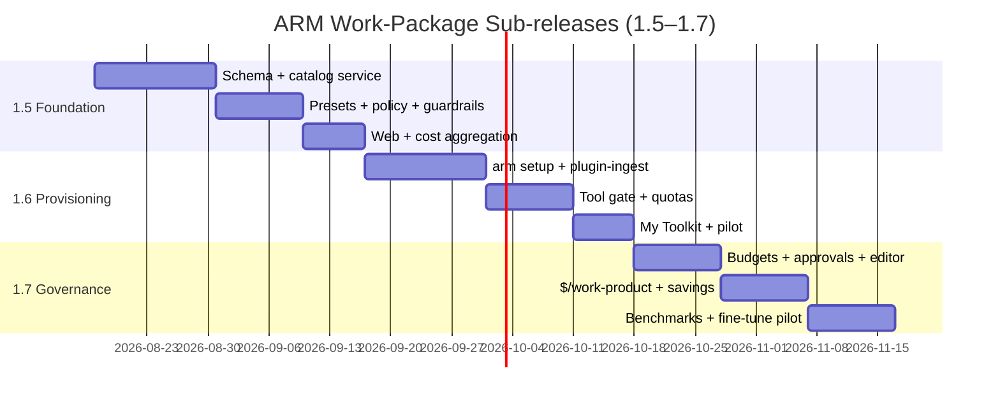

# Development Plan & Roadmap — Govern + Enable

Companion to `2026-08-13-d9-work-packages.md` (the decision). This doc is the build plan.

**Mission:** make ARM the surface where management _governs_ AI usage per employee/job function, and every employee — from shop-floor operator to plant manager to executive, none of them coding experts — _uses_ a correctly-configured agent (opencode pre-installed with MCPs, skills, sub-agents, permissions) within minutes of starting.

Research inputs: `docs/research/oem-job-taxonomy.md` (who exists), `docs/research/oem-work-package-design.md` (what each role does daily + what to bundle), `docs/research/token-cost-optimization.md` (where the money goes + the moat).

---

## 1. Two pillars, one unit

| Pillar     | Audience                                                         | Promise                                                                                                | Delivered by                                                                          |
| ---------- | ---------------------------------------------------------------- | ------------------------------------------------------------------------------------------------------ | ------------------------------------------------------------------------------------- |
| **Govern** | Executives, scope admins, IT, InfoSec                            | See and control every AI usage: who, what model, what tools, what data, what it cost, per work product | Per-package budgets + approvals + deny-override + `$/work-product` dashboards + audit |
| **Enable** | Every employee (low/mid/high management, operators, specialists) | Start using an agent for _their_ job in < 5 minutes, zero config files, zero decisions to make         | `arm setup` + role Work Packages + starter templates + chat-first UX                  |

**The unit that joins them: the Work Package** (D9). Management publishes and budgets packages; employees install packages. Neither side sees the other's complexity.

---

## 2. Personas & their required experience

| Persona                                             | Technical level | First-run experience (target)                                                                                                        | Daily experience                                                           |
| --------------------------------------------------- | --------------- | ------------------------------------------------------------------------------------------------------------------------------------ | -------------------------------------------------------------------------- |
| Shop-floor operator / technician                    | Near-zero       | Scan QR → app opens with role package → speak/type "bearing temperature spiked, what do I do?" → guided fix + CMMS work order logged | Voice/scan-first, checklists, fault-code lookups, tiny deterministic tools |
| Office specialist (planner, buyer, quality analyst) | Low             | `arm setup` → pick role → chat opens with starter cards: "Triaged 14 MRP exceptions", "Draft 8D for defect #4821"                    | Chat-first, template gallery, budget meter visible in chat                 |
| Mid manager (supervisor, plant manager)             | Low             | Same install → dashboards view: team usage, approvals inbox, shift-report generator                                                  | Approval one-tap, KPI briefings, auto-generated reports                    |
| Executive / higher management                       | Very low        | Web dashboard only — no local install needed                                                                                         | KPI cockpit, cost-per-work-product benchmarks, monthly exec digest         |
| Power user / engineer                               | High            | Same install → power mode unlocks config, custom MCPs, sub-agent editing                                                             | Full agent capabilities with guardrails still enforced                     |

**Design principle:** every persona starts in "beginner mode". Advanced surfaces (config, policy authoring) are progressive-disclosure, never required. The existing `deferred-shell panel` UX concept (CONCEPTS.md) is the home for advanced settings.

---

## 3. Ease-of-use design principles (the "very very very easy" contract)

1. **Zero decisions:** **updated by D10/D11** (`docs/solutions/2026-08-21-d11-questionnaire-provisioning.md`) — the _client_ still asks zero questions; the questionnaire that resolves "which role" moved to the web, _before_ the download (`apps/onboarding`, 6-9 multiple-choice questions, no free text — A5). What the employee runs (`arm setup`, or a double-clicked `.armsetup` file) presents a signed setup token, never a role picker. Everything else is still fetched and written automatically.
2. **Zero config files:** config is generated server-side from the package manifest and signed; the employee never sees YAML/JSON. Power users can export for editing.
3. **Chat-first, templates-first:** every package ships 5–10 starter prompts as tappable cards ("Draft an 8D for a seal leak", "Summarize today's andon stops"). The first successful task is one tap away.
4. **Inline governance, not lectures:** the budget meter, approval prompts, and deny explanations appear inside the chat surface. Policy is experienced, not read.
5. **One installer, all runtimes:** the same flow installs opencode if missing (winget/homebrew/npm), verifies the metered round-trip, and leaves a green check. Failure modes are auto-detected with plain-language fixes.
6. **Management mode is read-only joy:** executives get dashboards + approvals, not configuration. Every governance action is a one-tap approve/deny or a plain-language rule ("Quality dept may not use closed models for confidential drawings" → translated into policy).
7. **Verification is visible:** first-run ends with "Your agent is online. Your dept's remaining budget: $X. Your approved tools: N." Trust through visibility.

---

## 4. Architecture: what changes, component by component

| Component                                | Change                                                                                                                                                                                                                                                                                         |
| ---------------------------------------- | ---------------------------------------------------------------------------------------------------------------------------------------------------------------------------------------------------------------------------------------------------------------------------------------------- |
| `packages/proto`                         | New zod contracts: `tool`, `tool_version`, `work_package`, `work_package_version`, `package_assignment`; `token_usage_event` additive fields (`package_id`, `steps`, `tool_calls`, `cache_read_tokens`, `semantic_cache_hit`)                                                                  |
| `packages/db`                            | New Drizzle tables per D9 §Consequences; `budget` gains `package_id`/`work_type` reservation dimensions; `permission_grant` gains `tool:*` verbs (D8 extension)                                                                                                                                |
| `packages/profiles`                      | New `WorkPackageSeed` in the D6 profile bundle; Manufacturing + Tech presets ship 10 pilot packages (from research); pure-data rule preserved (JSON-serializable, never gate capabilities)                                                                                                     |
| `packages/catalog` (new)                 | Tool Registry + Work Package service: CRUD, versioning, integrity hashes, publish/approve workflow, package→config rendering (the signed config generator)                                                                                                                                     |
| `packages/client-core` (new)             | Shared installer/provisioner engine used by Desktop + CLI: SSO, runtime ensure, package apply, connections wizard, config integrity checks, self-update                                                                                                                                        |
| ~~`apps/desktop`~~                       | **Superseded by A7 (D10/D11) — no Desktop GUI.** Replaced by `apps/onboarding` (web questionnaire + setup-token issuance) and signed platform installers wrapping the `arm` CLI (`packaging/`) — same "no terminal for the common path" bar via double-clicking a downloaded `.armsetup` file. |
| Control plane (new service surface)      | Connection catalog (tool → auth method → versioned guide content → required scopes), vendor OAuth app registrations (Jira/GitHub/Google), guide content service, MDM manifest endpoint                                                                                                         |
| `packages/policy`                        | `resolveToolAccess` (tool:invoke with tiered delegation + deny-override), package-aware `resolveLLMModel` (per-package allowlists + auto-downgrade)                                                                                                                                            |
| `packages/classifier`                    | `tool_calls` already flow through stage 1; add package-id as a structural feature (labels get sharper for free)                                                                                                                                                                                |
| `apps/cli`                               | `arm setup` (SSO → role → install/configure/verify), `arm package list/request`, power-mode `arm package export`                                                                                                                                                                               |
| `apps/data-plane/plugin-ingest`          | opencode first-class: package config writer (MCP servers, skills, sub-agents, permissions), metered round-trip verification; manifest gains `packages` section                                                                                                                                 |
| `apps/data-plane/proxy` + `open-gateway` | Tool-gate (invariant-1/D2 classification check per tool endpoint), per-package quota store, cache-read token accounting                                                                                                                                                                        |
| `apps/control-plane/web`                 | New IA sections: **Catalog** (packages + tools, app-store UX), **Assignments** (org tree × package matrix), **Governance** (budgets, approvals, cost-per-work-product, savings ledger, plain-language policy editor), **My Toolkit** (employee home)                                           |
| `scripts/guardrails`                     | 4 new guards per D9 (§package-integrity, package-least-privilege, tool-endpoint-scope, package-drift) — mutation-proofed per §14.2                                                                                                                                                             |
| `apps/simulation`                        | Demo fixture: pilot packages + cost-per-work-product stories for the dashboard                                                                                                                                                                                                                 |

**Boundary discipline:** `packages/catalog` sits between `db`/`profiles` and `trpc` (same layer as `billing`/`policy`). Data-plane apps import only `proto`/`config` — the tool gate reads package policy via the existing policy-cache pull (D5), never from the catalog directly.

---

## 5. Client packaging & connection wizard (the `arm` client)

**Reconciled with A4/A7 by D10/D11** (`docs/solutions/
2026-08-21-d11-questionnaire-provisioning.md`,
`docs/guides/03-client-downloader.md`): **no Desktop GUI app** (A7) and
**no per-user compiled binary** (A4). What ships instead —

**One signed generic client binary, one engine (`packages/client-core`), no per-employee build:**

| Artifact                                                                | Audience                                                          | Role                                                                                                                                     |
| ----------------------------------------------------------------------- | ----------------------------------------------------------------- | ---------------------------------------------------------------------------------------------------------------------------------------- |
| **`arm` CLI / SEA binary** (`arm`/`arm.exe`, `packaging/build-sea.mjs`) | Every employee, via a signed platform installer (MSI/pkg/deb/rpm) | No terminal needed for the common path: double-click a downloaded `.armsetup` file, or run `arm setup` and type a 6-char activation code |
| **Web questionnaire** (`apps/onboarding`, port 3300)                    | Every employee, before the download                               | Resolves job function → recommended package → issues the signed setup token (replaces the "role picker" below)                           |
| **`arm` CLI, advanced/CI path** (`arm setup --role <key>`)              | Power users, CI, automated-agent fleets                           | Same engine, direct role-key provisioning (D9 Phase 1.6 behaviour, unchanged)                                                            |
| **MDM packages** (Intune MSI, Jamf pkg, winget, homebrew)               | IT org-wide rollout                                               | Silent install of the SAME signed binary; per-user customization still travels via setup token, never a per-deployment build             |

### 5.1 First-run experience (≤ 5 minutes, zero config)

1. **Questionnaire** (browser, `apps/onboarding` — SSO or invite-code gated): 6-9 multiple-choice questions, no free text (A5) — replaces the old "SSO + role picker" step below the client
2. **Download**: setup token issued, travels as a `.armsetup` file or a 6-char activation code
3. **Double-click (or `arm setup --token`/interactive code prompt)** — the client itself asks nothing
4. **Runtime ensure** — opencode auto-detected, installed if missing (version-pinned)
5. **Package apply** — components installed by verified digest (manifest v2), MCP servers/skills/sub-agents/permissions/starter prompts all from the signed, redeemed manifest; config integrity re-checked at every agent start (tamper detection)
6. **Connections** — the credential wizard for package tools that need third-party auth (below)
7. **Verify** — metered round-trip → _"Online. Dept budget remaining: $X. Tools connected: M/N. Starter tasks ready."_

### 5.2 The connections wizard — "how do I get a Jira/GitHub/AWS/BigQuery token?"

Every package ships a **connections manifest**: tool → auth method → guide content id → required scopes. The wizard renders only what the user's package needs, in two tiers:

- **Tier A — OAuth/SSO, one click** (Jira/Atlassian, GitHub, Google Workspace + GCP/BigQuery, Microsoft 365/SharePoint, AWS IAM Identity Center): "Connect" → browser authorize → ARM data-plane connector mints a **short-lived, least-scope token** via the existing mint/proxy/sync strategies (invariant 4). No copy-paste, ever.
- **Tier B — PAT / service-account flows** (Jira PAT, GitHub PAT, GCP service-account keys, legacy systems): the wizard renders **server-pushed, versioned step-by-step guides** — exact vendor-console clicks, scope presets pre-filled per package, paste-back field with validation. Guides are content served from the control plane and updated without client releases (vendor UIs change; our guides must not be frozen in the installer).

**Setup-guides requirement, met:** guides are not a PDF — they are live, versioned content embedded in the wizard, and installing the package _is_ installing the guides for that package.

**Security principles (non-negotiable):**

- Secrets **never** land in agent config files: config references OS-keychain entries or tenant-vault broker endpoints (invariant 5: ARM-issued OIDC where federated; sealed tenant vault where not).
- Short-lived everywhere (invariant 4) + rotation nudges in the **credential health center** (expiry, drift, per-package "connections needed" checklist).
- Skip-later is allowed: the package installs fully; the unconnected tool shows as "not connected" until the wizard is completed. Re-enter anytime from the tray/desktop status.

### 5.3 Distribution & trust

- Code signing + notarization (EV cert Windows, notarized macOS) from first beta — unsigned binaries get blocked by SmartScreen/Gatekeeper and kill the "very easy" promise; MDM deployment bypasses SmartScreen prompts.
- Signed release channel + self-update; version check against the control plane (ties into the `package-drift` guardrail from D9).
- Client is thin: it renders server-driven flows; the heavy lifting (package manifests, guides, policy) stays in the control plane.

---

## 6. Pilot package set (seeded from research)

| Package                  | Mode               | Target persona                         | Signature tools (MCP)                         | Skills/templates                                                             | Routing & budget shape                                            |
| ------------------------ | ------------------ | -------------------------------------- | --------------------------------------------- | ---------------------------------------------------------------------------- | ----------------------------------------------------------------- |
| `quality_engineer`       | copilot            | PQE                                    | SPC/CMM connector, MES defect feed, ticketing | 8D generator, control-plan editor, PPAP checklist, IATF clause library       | Frontier for 8D root-cause; small model for form fill; Medium cap |
| `sqe_supplier_quality`   | copilot            | SQE                                    | Supplier portal, PPAP inbox, SCAR tracker     | VDA 6.3 audit kit, 8D/SCAR templates, chargeback calculator                  | High cap (doc-heavy)                                              |
| `plc_programmer`         | copilot            | Controls eng                           | OPC UA diagnostics, code repo, IO table       | Ladder/ST codegen patterns, AOI library, alarm templates, diff/merge tooling | Frontier for codegen; loop caps; open-model fallback              |
| `maintenance_technician` | copilot            | Maintenance tech                       | CMMS, fault-code KB, spares catalog           | Fault→fix playbooks, SOP checklists, escalation trees                        | Low cap, cheap model, mobile-first — the flagship fault loop      |
| `material_planner`       | automated (assist) | Material planner                       | MRP/ERP, supplier EDI                         | Exception-triage cards, ECN impact alerts, EOL calculators                   | Small-model batch, High volume / Low per-call                     |
| `production_supervisor`  | copilot            | Shift supervisor                       | MES/andon feed, CMMS                          | Shift-report generator, handover templates, staffing models                  | Low-Medium cap, cheap-first routing                               |
| `warranty_analyst`       | copilot            | Warranty analyst                       | Warranty data warehouse, claims API           | Pareto/early-warning analytics, chargeback bundles, reserve memos            | Medium-High cap (evidentiary docs)                                |
| `data_analyst_plant`     | copilot            | Plant data analyst                     | Historian (PI), lakehouse, BI                 | SPC/downtime notebooks, OEE calculators, dashboard builders                  | Medium cap; query-minimization bundling                           |
| `office_worker_general`  | copilot            | Every office employee (volume default) | SharePoint, email, chat, web search           | Meeting-notes→actions, doc summarization, mail triage                        | Low cap per seat, cheapest viable model — scales to thousands     |
| `exec_assistant`         | copilot            | Executives/managers                    | Dashboard APIs, approvals inbox, CRM          | KPI briefing generator, exec digest, approval summaries                      | Low cap; aggregates-only guardrail enforced                       |

`office_worker_general` and `exec_assistant` matter disproportionately: they are how non-technical low/mid/high management experience the platform, and they must feel effortless.

---

## 7. Phased roadmap (extends spec §9; assumes 2–3 engineers, zero slack)

### Phase 1.5 — Work Package foundation (Weeks 1–4)

**Goal:** the package is a real, governed, metered entity in the control plane.

1. Schema + migrations: tool/tool_version/work_package/work_package_version/package_assignment; budget + grant extensions (D9 §Consequences).
2. `packages/catalog`: CRUD, versioning, integrity hashing, publish→approve workflow.
3. Profile presets: 10 pilot packages seeded in Manufacturing + Tech profiles (research → `WorkPackageSeed`).
4. Policy: `resolveToolAccess` + package-aware model routing; unit + integration tests.
5. Web: Catalog + Assignments + Governance (budgets/approvals) pages — lo-fi first, design system pinned.
6. Guardrails: 4 new checks, mutation-proofed (break the protected thing → guard goes red → restore byte-identically).
7. `token_usage_event` additive columns + migration; cost-per-work-product aggregation job (work-type × package × completed-task telemetry).

**Exit gate:** a package can be published, approved, assigned to an org node, budgeted, and its usage broken out by work type — all via API/UI, all green in CI; guardrails mutation-proofed; spec §4.1/§4.2/§14.1 updated in the same PR series (Spec Travel Rule).

### Phase 1.6 — One-click provisioning + copilot mode (Weeks 5–8)

**Goal:** an employee with zero technical skill goes from nothing to a metered, role-configured agent in < 5 minutes.

1. `packages/client-core` + `arm setup` (CLI head): SSO → role picker (assignment-aware) → runtime detection/install (opencode first) → package manifest fetch → signed config write (MCP servers with short-lived scoped tokens, skills, sub-agents, permissions) → metered round-trip verification. All failure modes auto-detected with plain-language fixes.
2. **ARM Desktop client** (`arm_client.exe`/`.app`/`.deb`): GUI wizard on the same engine; code signing + notarization; MDM packages (Intune/Jamf) + winget/homebrew; tray status (budget meter, approvals).
3. **Connections wizard + guide content service**: Tier A one-click OAuth (first wave: Jira, GitHub, Google incl. BigQuery — start vendor app registrations at 1.5 kickoff); Tier B server-pushed step-by-step guides (PAT/service-account) with paste-back validation; credential health center (expiry, rotation, drift).
4. Plugin-ingest: opencode package writer + manifest `packages` section; config integrity re-check at every agent start (tamper detection).
5. Data plane: tool gate at proxy/open-gateway (per-tool classification check per D2/invariant 1), per-package quota enforcement, cache-read accounting.
6. Web: **My Toolkit** employee home — install flow, starter cards, template gallery, budget meter, approval status; chat-first UX.
7. `docs/agent-onboarding-guide.md` rewrite: the employee path is the Desktop client / `arm setup`; the manual config path becomes the advanced fallback.
8. Pilot: 5–10 roles × real (internal) employees; daily usage + friction telemetry (where do people stall?).

**Exit gate:** E2E green — new user → Desktop client → first metered call → package-attributed event in ClickHouse → visible on My Toolkit, all < 5 min, **unassisted**; ≥ 1 OAuth connection completed without copy-paste; zero secrets in agent config files (guardrail-checked); tool gate deny emits `access_audit_event(decision=deny, reason="tool_gate")`; config tamper is detected and reported.

### Phase 1.7 — Governance loop + moat metrics (Weeks 9–12)

**Goal:** management can run the fleet from dashboards, and ARM's differentiator metrics are live.

1. Per-package + per-work-type budget reservations and alerts; plain-language policy editor (natural language → policy rule preview → apply).
2. Approvals UX: one-tap inbox (tool requests, budget increases, tier elevations) with email/webhook outbound.
3. `$/work-product` dashboards with rework-rate counterweight; savings ledger (causally attributed: cache hits, routed-down calls, loop caps); monthly exec digest.
4. Cross-tenant anonymized benchmarks (per industry profile, aggregates-only — invariant-respecting).
5. Fine-tuned small-model pilot for one volume task (e.g. MRP exception classification) — proves the 90%+ marginal-cost path.
6. Pilot expansion + re-attestation cadence (package re-approval, stakeholder re-attestation).

**Exit gate (Phase 1.y extension):** ≥ 2 pilot tenants running ≥ 3 packages each; ≥ 80% of metered calls carry `package_version_id`; ≥ 1 management decision made from a `$/work-product` dashboard with recorded $ delta; approval round-trip < 1 min; all new guardrails still green under mutation testing.

### Sequencing & slip policy

Slip policy mirrors spec §9: if 1.6's installer or 1.7's fine-tune pilot slips, shed the fine-tune pilot first (it is an optimization, not a capability); never compress guardrail mutation-proofing. Sub-releases ship behind feature flags.

### Success criteria (Phase 1.y additions)

| Metric                                              | Target                                                                              |
| --------------------------------------------------- | ----------------------------------------------------------------------------------- |
| Time-to-first-metered-call (non-technical employee) | < 5 min, no config files touched                                                    |
| Package coverage of metered traffic                 | ≥ 80% of calls carry `package_version_id`                                           |
| Governance coverage                                 | 100% of tool invocations authorized; denies audited < 1 min                         |
| Cost steering                                       | ≥ 1 package family ≥ 50% below naive frontier baseline (savings ledger proof)       |
| Management engagement                               | ≥ 1 exec decision made from `$/work-product` dashboard per pilot tenant/month       |
| Friction funnel                                     | ≥ 70% of employees who start `arm setup` complete the metered round-trip unassisted |

---

## 8. Risks & mitigations

| Risk                                                          | Impact                               | Mitigation                                                                                                                                                    |
| ------------------------------------------------------------- | ------------------------------------ | ------------------------------------------------------------------------------------------------------------------------------------------------------------- |
| Vendor OAuth app review delays (Jira/GitHub/Google approvals) | Phase 1.6 slip                       | Start app-registration requests at 1.5 kickoff; Tier B PAT wizard works without vendor approval                                                               |
| Code-signing/notarization + SmartScreen/Gatekeeper reputation | Install blocks undermine "very easy" | EV cert + notarization from first beta; MDM path bypasses SmartScreen prompts                                                                                 |
| Desktop shell mispicked (Electron vs Tauri)                   | Rework in 1.6                        | Decide at 1.6 kickoff: Tauri (small footprint, Rust toolchain) vs Electron (TS-only, heavier); both reuse client-core                                         |
| Config writer drift across agent runtime releases             | Broken provisioning = dead trust     | Pin opencode min version in package; integrity re-check at agent start; CI matrix against opencode releases                                                   |
| Tool gate adds proxy latency                                  | Blows §5.2 budget                    | Tool policy resolved from the policy cache (D5 pull) — no catalog round-trip on the hot path                                                                  |
| Package preset explosion (20 functions × variants)            | Catalog bloat                        | Role-level packages only (sub-decision 1); family variants capped; custom packages behind admin                                                               |
| Employees bypass packages with bare agents                    | Governance holes                     | Bare agents get the minimal default package (no tools) — the platform makes the packaged path the easy path; bypass agents stay visible via `source` + policy |
| "Cheapest per 8D" quality collapse                            | Compliance risk                      | Rework-rate counterweight is a first-class metric; co-meter verifiability (citations, clause-versioned caches)                                                |
| Fine-tune distribution shift on new product lines             | Silent quality drop                  | Per-task eval harness + drift guardrail before any fine-tuned model is production-routable                                                                    |

## 9. Open questions for sign-off

1. Package approval authority: scope-admin alone, or scope-admin + stakeholder for copilot packages handling `confidential`+ data? (D9 sub-decision 4 default)
2. `office_worker_general` — should it be auto-assigned org-wide at provisioning (max ease) or opt-in per department (max control)?
3. Fine-tune pilot scope: MRP exception triage (volume win) vs 8D section drafting (quality win) first?
4. Desktop shell: Tauri or Electron?
5. Connections wizard first wave: Jira/GitHub/Google-BigQuery confirmed, plus AWS SSO + SharePoint — vendor priority to confirm?
6. MDM silent install required for the pilot, or self-service download first?
